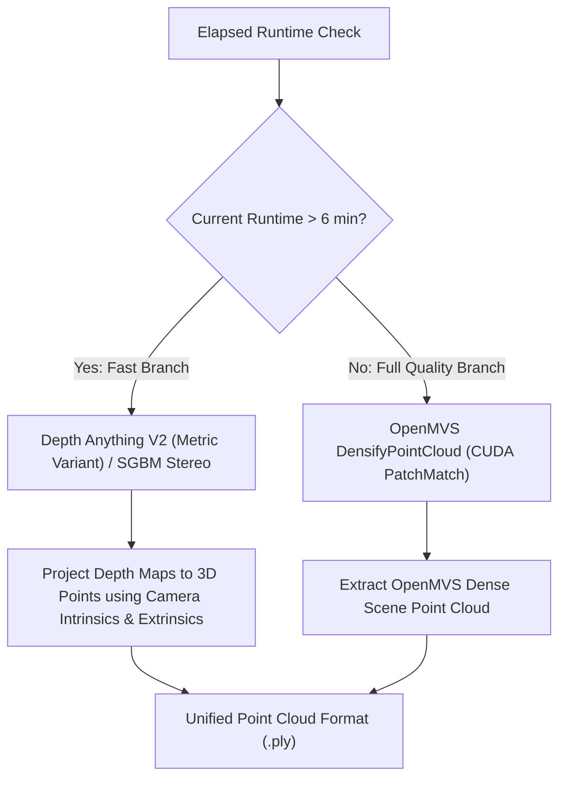

# Technical Architecture Specification: SIH26158 Drone 3D Reconstruction

**System Architecture, Algorithmic Foundations, Data Contracts, and Failure Modes**  
*Document Version: 2.0.0 | Problem Statement: SIH26158 | Author: @Shshank Kumar (Synthesized)*

---

## 1. Context, Critique, and Architectural Rationale

### 1.1 Why MASt3R-SLAM is the Wrong Tool
Initial attempts explored **MASt3R-SLAM**, but this approach exhibits fundamental domain mismatches with the SIH26158 problem statement:
- **SLAM vs. Photogrammetry**: SLAM is optimized for live camera tracking, real-time pose estimation, and maintaining a sparse or semi-dense incremental map for robotic navigation. It does not optimize for surface topology, global metric bundle adjustment, or photorealistic surface texturing.
- **Surface & Mesh Incapacity**: MASt3R-SLAM outputs point clouds without watertight triangle meshing or UV texture projection. Generating an engineering-grade textured mesh from SLAM outputs requires secondary post-processing steps that are slower than a native photogrammetry pipeline.
- **Metric Scale & Georeferencing**: SLAM suffers from scale drift over monocular trajectories unless continuous visual-inertial priors are tightly coupled. It lacks native geodetic coordinate transformations ($\mathrm{WGS84} \to \mathrm{ECEF} \to \mathrm{ENU}$) and projection to Geographic Information Systems (GIS) coordinate reference systems (CRS).

### 1.2 The Classical MVS Bottleneck (The Peter Falkingham Benchmark)
A standard offline pipeline (Incremental COLMAP + OpenMVS) on a single workstation (e.g., NVIDIA RTX 2060 Super) benchmarks as follows for ~500 frames:
- `COLMAP Feature Extraction & Matching`: 4–8 minutes
- `COLMAP Incremental Mapper`: 6–12 minutes
- `OpenMVS DensifyPointCloud`: 8–15 minutes
- `OpenMVS ReconstructMesh`: 2–4 minutes
- `OpenMVS RefineMesh`: **18–22 minutes**
- `OpenMVS TextureMesh`: 2–4 minutes
- **Total Duration**: **40–65+ minutes** (Dramatically exceeding the 15-minute budget).

`RefineMesh` alone consumes almost half the entire time budget while offering sub-millimeter edge improvements that are irrelevant for 50-meter altitude aerial drone surveys. Therefore, **`RefineMesh` must be dropped by default under time pressure**, and the depth engine must be modularized into a dual-branch architecture.

### 1.3 Prior Art & Competitive Landscape
Analysis of peer repositories targeting SIH26158 reveals distinct implementation choices:

```
┌─────────────────┬──────────────────────────┬─────────────────────────────┬──────────────────────┬──────────────────────────────────────────┐
│ Team / Repo     │ Pose Recovery            │ Depth / Geometry            │ Dynamic Masking      │ Notable Choices / Gaps                   │
├─────────────────┼──────────────────────────┼─────────────────────────────┼──────────────────────┼──────────────────────────────────────────┤
│ DroneMap        │ COLMAP Sequential + GPS  │ OpenMVS (core), VGGT/DAv2   │ YOLOv8-seg (core),   │ Most complete plan; ground-plane PCA     │
│                 │ priors                   │ listed as stretch           │ SAM2 (stretch)       │ fit, RTK/PPK tier. OpenPointClass missing│
├─────────────────┼──────────────────────────┼─────────────────────────────┼──────────────────────┼──────────────────────────────────────────┤
│ Aero3D          │ Visual Odometry + GPS    │ Depth Anything V2 + SGBM    │ CLIPSeg + Optical    │ Completely bypasses MVS for speed;       │
│                 │ (DJI SRT parsing)        │ stereo pairs (no full MVS)  │ flow rejection       │ lower surface geometric quality          │
├─────────────────┼──────────────────────────┼─────────────────────────────┼──────────────────────┼──────────────────────────────────────────┤
│ aerorecon       │ COLMAP + SIFT fallback   │ MiDaS + DAv2 + 3DGS PLY     │ YOLOv8n-seg + frame  │ 3D Gaussian Splatting focus; lacking     │
│                 │                          │                             │ differencing         │ watertight engineering mesh              │
├─────────────────┼──────────────────────────┼─────────────────────────────┼──────────────────────┼──────────────────────────────────────────┤
│ Our Architecture│ COLMAP + GLOMAP Global   │ Dual-Branch: Depth Anything │ YOLOv8-seg 3-Tier    │ OpenPointClass ASPRS classification;     │
│ (v2 Optimized)  │ Bundle Adjustment        │ V2 (Fast) OR OpenMVS (Full) │ Lifecycle Reuse      │ Closed-form Umeyama Sim(3) with RMS log  │
└─────────────────┴──────────────────────────┴─────────────────────────────┴──────────────────────┴──────────────────────────────────────────┘
```

**Key Architectural Takeaway**: Top teams avoid relying solely on classical PatchMatch MVS. Our v2 architecture introduces **adaptive runtime branching** paired with **ASPRS semantic classification** as the primary competitive differentiator.

---

## 2. End-to-End System Flowchart

```mermaid
flowchart TD
    subgraph INGEST["1. Ingest & Pre-Processing"]
        V["Raw Drone Video<br/>(1080p/4K @ 30fps)"] --> FF["FFmpeg Keyframe Extraction<br/>(Sample every Nth frame)"]
        V --> SRT["DJI SRT Telemetry Parser<br/>(Lat, Lon, Alt, Pitch, Yaw)"]
        FF --> BLUR["OpenCV Laplacian Blur Scoring<br/>(Filter top 400-600 frames)"]
        SRT --> GPS_CSV["frame_gps.csv<br/>(Interpolated Timestamps)"]
        BLUR --> KF_DIR["keyframes/<br/>(Enhanced via CLAHE)"]
    end

    subgraph MASKING["2. Dynamic Object Segmentation"]
        KF_DIR --> YOLO["YOLOv8-seg Inference<br/>(Classes: car, bus, person, truck)"]
        YOLO --> MASK_DIR["masks/<br/>(Binary 8-bit single channel)"]
    end

    subgraph POSE["3. Pose Estimation & Global SfM"]
        KF_DIR --> COL_FEAT["COLMAP Feature Extractor<br/>(SIFT GPU with --mask_path)"]
        MASK_DIR -.-> COL_FEAT
        COL_FEAT --> COL_MATCH["COLMAP Sequential Matcher<br/>(Ordered video sequence + loop closure)"]
        COL_MATCH --> GLOMAP["GLOMAP Global Mapper<br/>(Relative rotations + translation averaging)"]
        GLOMAP --> SPARSE["sparse/0/<br/>(cameras.bin, images.bin, points3D.bin)"]
    end

    subgraph GEOREF["4. Coordinate Transformation & Scale"]
        SPARSE --> UME["Umeyama 7-DoF Sim(3) Solver<br/>(Camera centers vs Local ENU coordinates)"]
        GPS_CSV --> UME
        UME --> GEOREF_JSON["georef.json<br/>(s, R, t, RMS error metric)"]
    end

    subgraph DEPTH["5. Adaptive Depth Reconstruction"]
        GEOREF_JSON --> TIMER{"Live Elapsed Timer<br/>> 6 minutes?"}
        TIMER -->|"Yes (Time Tight)"| FAST_DEPTH["Fast Branch: Depth Anything V2<br/>Metric Depth / SGBM Stereo Pairs"]
        TIMER -->|"No (Time Budget OK)"| FULL_DEPTH["Quality Branch: OpenMVS<br/>DensifyPointCloud (PatchMatch)"]
        FAST_DEPTH --> DENSE_RAW["dense_pointcloud_raw.ply"]
        FULL_DEPTH --> DENSE_RAW
    end

    subgraph POINT_FUSION["6. Point Cloud Fusion & Re-Masking"]
        DENSE_RAW --> O3D_FUSE["Open3D Fusion & Filtering<br/>(Voxel Grid + Statistical Outlier Removal)"]
        MASK_DIR -.->|"Dynamic filter back-projection"| O3D_FUSE
        O3D_FUSE --> CLEAN_PC["dense_filtered.ply"]
    end

    subgraph MESHING["7. Surface Geometry & Texturing"]
        CLEAN_PC --> MVS_MESH["OpenMVS ReconstructMesh<br/>(Delaunay tetrahedral surface estimation)"]
        MVS_MESH --> MVS_TEX["OpenMVS TextureMesh<br/>(Masked frame projection + seam blending)"]
        MASK_DIR -.->|"Exclude moving objects"| MVS_TEX
        MVS_TEX --> RAW_OBJ["textured_mesh.obj + .mtl"]
    end

    subgraph CLASSIFICATION["8. Semantic Classification"]
        CLEAN_PC --> OPC["OpenPointClass Classifier<br/>(ASPRS Standards: Ground, Building, Veg, Road)"]
        OPC --> CLASS_LAZ["classified.laz"]
    end

    subgraph EXPORT["9. Georeferenced Export & Delivery"]
        RAW_OBJ --> PDAL_APP["Apply Sim(3) Transformation Matrix<br/>(s * R * x + t)"]
        CLASS_LAZ --> PDAL_APP
        GEOREF_JSON -.-> PDAL_APP
        PDAL_APP --> FINAL_OBJ["georeferenced_mesh.obj / glTF"]
        PDAL_APP --> FINAL_LAZ["georeferenced_classified.laz"]
        PDAL_APP --> GDAL_ORTHO["GDAL Orthomosaic Generator<br/>(GeoTIFF Raster)"]
        FINAL_OBJ --> WEB_VIEW["CesiumJS / Potree 3D Tiles Viewer"]
        FINAL_LAZ --> WEB_VIEW
    end

    style TIMER fill:#ff9900,stroke:#333,stroke-width:2px
    style WEB_VIEW fill:#00cc66,stroke:#333,stroke-width:2px
    style GEOREF_JSON fill:#3399ff,stroke:#333,stroke-width:2px
```



---

## 3. Stage-by-Stage Engineering Specification

### Stage 1: Keyframe Extraction & Telemetry Synchronization
- **Input**: Raw monocular video stream (`.mp4`/`.mov`, 1080p/4K @ 30fps), DJI embedded SRT subtitle stream or external flight telemetry CSV.
- **Mechanism**:
  - Decode keyframe candidates every $N$ frames ($N = \text{fps} \times 0.5$, sampling at ~2 Hz).
  - Compute OpenCV Laplacian variance:
    $$\sigma_L^2 = \mathrm{Var}(\nabla^2 I)$$
  - Reject frames with $\sigma_L^2 < \tau_{\text{blur}}$ (dynamic blur threshold).
  - Retain the top **400–600 frames** based on sharpness and consecutive feature displacement.
  - Parse per-frame telemetry: Latitude, Longitude, Barometric/Ellipsoidal Altitude, Gimbal Pitch, Roll, Yaw. Interpolate to extract frame-accurate GPS coordinate entries.
- **Outputs**:
  - `keyframes/frame_%05d.png`
  - `frame_gps.csv` (Columns: `frame_id, timestamp, lat, lon, alt, roll, pitch, yaw`)

### Stage 2: Quality Enhancement (Selective Filtering)
- **Design Rule**: *Never process the 18,000 raw frames with heavy neural filters; apply fast classical filters only on the 400–600 selected keyframes.*
- **Mechanism**:
  - Contrast Limited Adaptive Histogram Equalization (CLAHE) applied to the luminance channel ($L^*$ in $L^*a^*b^*$ color space) to normalize intense ground shadows and high-noon sunlight.
  - Fast bilateral filtering for noise attenuation while preserving structural edge contrast.

### Stage 3: Dynamic Object Detection & 3-Tier Mask Lifecycle
- **Problem**: Ephemeral elements (moving cars, pedestrians, flying birds) cause ghosting in point clouds, false tie-point matching in SfM, and smeared textures on roads.
- **Model**: `Ultralytics YOLOv8x-seg` (or `YOLOv8m-seg` for speed). Segment COCO classes: `[0: person, 1: bicycle, 2: car, 3: motorcycle, 5: bus, 7: truck]`.
- **Mask Lifecycle (Reused in 3 Discrete Stages)**:
  1. **SfM Feature Extraction**: Passed to COLMAP as `--ImageReader.mask_path` to prevent SIFT detectors from creating descriptors on moving vehicles.
  2. **Dense Point Cloud Fusion (Stage 8)**: Re-applied in Open3D by back-projecting dynamic masks into 3D voxel space to excise transient points that passed through epipolar stereo.
  3. **Mesh Texturing (Stage 11)**: Passed to OpenMVS `TextureMesh` to prevent moving vehicles from being baked into the pavement texture.
- **Output**: `masks/frame_%05d.png` (8-bit single-channel binary mask, 255 = dynamic object).

---

### Stage 4 & 5: Feature Extraction, Matching & Global SfM (GLOMAP)
- **Tooling**: `COLMAP` (CUDA-accelerated SIFT) + `GLOMAP`.
- **Feature Extraction**:
  - Extract GPU-accelerated SIFT descriptors strictly on unmasked regions.
- **Matching Strategy**:
  - Monocular drone video frames are inherently ordered. Use **Sequential Matching** with an overlap window of 10 frames combined with **Vocab-Tree Loop Closure**:
    $$\text{Match Complexity}: \mathcal{O}(N \times k) \ll \mathcal{O}(N^2) \text{ (Exhaustive)}$$
- **Global Structure-from-Motion (GLOMAP)**:
  - Rather than standard incremental mapper (which solves small PnP and performs thousands of local Bundle Adjustments), GLOMAP:
    1. Solves view graph rotations globally using rotation averaging.
    2. Recovers camera translations through linear global position optimization.
    3. Executes one or two global Bundle Adjustments over the entire trajectory.
  - **Speed Advantage**: $3\times$ to $5\times$ faster than COLMAP Incremental Mapper.
- **Outputs**:
  - `sparse/0/cameras.bin`, `sparse/0/images.bin`, `sparse/0/points3D.bin`.

---

### Stage 6: GPS+IMU Fusion & 7-DoF Umeyama $\mathrm{Sim}(3)$ Alignment
Reconstructed SfM models are defined up to an arbitrary Euclidean coordinate frame and unknown scale factor. We establish metric georeferencing in a single, closed-form step without non-linear bundle adjustment overhead.

#### Mathematical Formulation
Let $\mathbf{X}_{\text{SfM}} = \{\mathbf{x}_i\}_{i=1}^M \subset \mathbb{R}^3$ denote the recovered camera optical centers in COLMAP space.  
Let $\mathbf{Y}_{\text{GPS}} = \{\mathbf{y}_i\}_{i=1}^M \subset \mathbb{R}^3$ denote corresponding drone GPS positions transformed into a local **East-North-Up (ENU)** metric Cartesian frame via `pymap3d`:
$$\mathbf{y}_i = \text{geodetic2enu}(\text{lat}_i, \text{lon}_i, \text{alt}_i, \text{lat}_0, \text{lon}_0, \text{alt}_0)$$

We solve for the similarity transformation matrix $\mathbf{T} \in \mathrm{Sim}(3)$ consisting of scale $s \in \mathbb{R}^+$, rotation $\mathbf{R} \in \mathrm{SO}(3)$, and translation $\mathbf{t} \in \mathbb{R}^3$:
$$\min_{s, \mathbf{R}, \mathbf{t}} \frac{1}{M} \sum_{i=1}^M \|\mathbf{y}_i - (s \mathbf{R} \mathbf{x}_i + \mathbf{t})\|^2$$

Using the **Umeyama closed-form singular value decomposition (SVD)**:
1. Centroid calculation:
   $$\boldsymbol{\mu}_x = \frac{1}{M}\sum_{i=1}^M \mathbf{x}_i, \quad \boldsymbol{\mu}_y = \frac{1}{M}\sum_{i=1}^M \mathbf{y}_i$$
2. Covariance matrix:
   $$\boldsymbol{\Sigma}_{xy} = \frac{1}{M} \sum_{i=1}^M (\mathbf{y}_i - \boldsymbol{\mu}_y)(\mathbf{x}_i - \boldsymbol{\mu}_x)^T$$
3. SVD decomposition:
   $$\boldsymbol{\Sigma}_{xy} = \mathbf{U} \mathbf{D} \mathbf{V}^T$$
4. Optimal Rotation $\mathbf{R}$:
   $$\mathbf{R} = \mathbf{U} \mathbf{S} \mathbf{V}^T, \quad \mathbf{S} = \begin{cases} \mathbf{I} & \text{if } \det(\mathbf{U})\det(\mathbf{V}) = 1 \\ \text{diag}(1, 1, -1) & \text{if } \det(\mathbf{U})\det(\mathbf{V}) = -1 \end{cases}$$
5. Scale $s$ and Translation $\mathbf{t}$:
   $$s = \frac{1}{\sigma_x^2} \text{Tr}(\mathbf{D} \mathbf{S}), \quad \mathbf{t} = \boldsymbol{\mu}_y - s \mathbf{R} \boldsymbol{\mu}_x$$

#### Error Quantification
Compute the Root Mean Square Error (RMSE):
$$\text{RMSE} = \sqrt{\frac{1}{M} \sum_{i=1}^M \|\mathbf{y}_i - (s \mathbf{R} \mathbf{x}_i + \mathbf{t})\|^2}$$
- **Output Artifact**: `georef.json`
```json
{
  "scale": 1.04218,
  "rotation": [[0.9998, 0.0121, -0.0142], [-0.0123, 0.9998, -0.0118], [0.0140, 0.0120, 0.9998]],
  "translation": [432104.12, 3145920.84, 214.50],
  "rms_error_meters": 1.42,
  "datum": "WGS84",
  "local_crs": "EPSG:32643",
  "enu_origin": {"lat": 28.6139, "lon": 77.2090, "alt": 216.0}
}
```

---

### Stage 7: Adaptive Dense Depth Engine (The Dynamic Fork)



1. **Fast Branch (Depth Anything V2 / SGBM)**:
   - Evaluates consecutive frame pairs $(I_t, I_{t+1})$ with known relative baseline $\mathbf{T}_{t,t+1}$.
   - Depth Anything V2 generates metric monocular depth maps in milliseconds on GPU.
   - Stereo consistency check discards unconstrained monocular depth artifacts.
   - Point back-projection:
     $$\mathbf{P}_w = \mathbf{R}_c^T \left( d(u,v) \mathbf{K}^{-1} \begin{bmatrix} u \\ v \\ 1 \end{bmatrix} - \mathbf{t}_c \right)$$
   - Processing time: **~1.5 minutes for 500 frames**.
2. **Full-Quality Branch (OpenMVS DensifyPointCloud)**:
   - Uses classical PatchMatch MVS with cross-view photo-consistency checks.
   - Retained only when running offline or on high-end hardware (A100 / RTX 4090).

---

### Stage 8: Point Cloud Fusion & Secondary Dynamic Filtering
- **Tool**: `Open3D`.
- **Operations**:
  1. Merge per-frame depth point clouds into a global coordinate array.
  2. Voxel downsampling (voxel size = $0.05\,\text{m}$ for high detail, $0.10\,\text{m}$ for fast mode).
  3. Statistical Outlier Removal (SOR): $k=30$ neighbors, $\text{std\_ratio} = 1.5$.
  4. **Dynamic Mask Back-Projection**: Raycast 3D points back onto camera frames; any point that projects into a dynamic mask region in $>50\%$ of observing views is pruned.
- **Output**: `dense_filtered.ply`.

---

### Stage 9 & 10: Watertight Surface Mesh Reconstruction
- **Tool**: `OpenMVS ReconstructMesh`.
- **Algorithm**:
  - Delaunay Tetrahedralization of 3D point samples.
  - Graph-cut optimization to label tetrahedra as "interior" or "exterior" based on visibility lines-of-sight from camera centers.
  - Generates manifold, watertight triangle mesh without Poisson hallucination artifacts over unobserved areas.
  - **RefineMesh Status**: By default **SKIPPED** in the fast pipeline (saving 15–20 minutes). Enabled only when `--quality full` flag is passed.
- **Output**: `mesh_raw.ply`.

---

### Stage 11: Texture Mapping & Seam Blending
- **Tool**: `OpenMVS TextureMesh`.
- **Algorithm**:
  - Determines optimal camera frame for each mesh face via view-angle and area coverage weighting.
  - Dynamic masks are provided to exclude dynamic entities from being projected onto the background geometry.
  - Global color leveling across varying camera exposures followed by multi-band Poisson seam blending.
- **Output**: `textured_mesh.obj`, `textured_mesh.mtl`, `textured_mesh.png`.

---

### Stage 12: ASPRS Semantic Classification (OpenPointClass)
- **Tool**: `OpenPointClass` (or PDAL `filters.smrf` + geometric Random Forest classifier).
- **Classification Taxonomy (ASPRS Standard)**:
  - `Class 2`: Ground / Terrain
  - `Class 3`: Low Vegetation (< 0.5m)
  - `Class 5`: High Vegetation / Trees (> 2.0m)
  - `Class 6`: Building / Rooftops
  - `Class 11`: Road Surface / Pavement
- **Performance**: Classifies 15 Million points in **under 2 minutes** on a 4-core CPU using eigenvalue-based geometric features (linearity, planarity, scattering, verticality).
- **Output**: `classified.laz` with standard ASPRS classification byte fields populated.

---

### Stage 13: Georeferenced Export & Deliverables Packaging
- **Tools**: `PDAL`, `GDAL`, `pyproj`.
- **Execution**:
  - Apply the closed-form $\mathrm{Sim}(3)$ matrix to `mesh_raw.obj` vertices and `classified.laz` point records:
    $$\mathbf{x}_{\text{georef}} = s \mathbf{R} \mathbf{x} + \mathbf{t}$$
  - Reproject from Local ENU to the appropriate UTM zone (e.g., `EPSG:32643`).
  - GDAL generates a Digital Elevation Model (DEM) and GeoTIFF Orthomosaic by orthographic rasterization.
- **Final Deliverables Folder**:
  - `deliverables/model.obj` + `model.mtl` (Metric scale 3D textured mesh)
  - `deliverables/model.glb` (Optimized for web viewers)
  - `deliverables/pointcloud_classified.laz` (ASPRS classified point cloud)
  - `deliverables/orthomosaic.tif` (Georeferenced GeoTIFF)
  - `deliverables/georef_metadata.json` (Transformation parameters & RMS error)

---

## 4. Addressing SIH26158 Technical Challenges

The SIH26158 problem statement specifies 8 core technical challenges. Below is the mapping to our mitigation architecture:

| # | SIH26158 Stated Challenge | Architectural Mitigation Strategy |
| :-: | :--- | :--- |
| **1** | **Limited viewing angles from single flight path** | Reject blind Poisson hole-filling (which hallucinates non-existent building rears). Compute per-surface camera ray intersection counts. Report an **Honest Coverage Metric** ($0.0 - 1.0$) and leave unobserved vertical facades as natural gaps. |
| **2** | **Motion blur & compression artifacts** | Pre-filtering via OpenCV Laplacian variance scoring ($\sigma_L^2$). Drop blurry frames before SfM feature detection. Apply CLAHE and bilateral filtering to selected frames only. |
| **3** | **Variable lighting and shadow transitions** | SIFT descriptor invariance to monotonic illumination changes + CLAHE equalization in $L^*a^*b^*$ space prior to feature extraction. Multi-band texture blending in OpenMVS during UV generation. |
| **4** | **Dynamic object handling** | **3-Tier Mask Lifecycle**: YOLOv8-seg dynamic masks applied at (1) COLMAP feature matching, (2) Open3D point fusion back-projection, and (3) OpenMVS texture projection. |
| **5** | **GPS inaccuracies & sensor noise** | Closed-form Umeyama $\mathrm{Sim}(3)$ alignment over all camera centers mitigates individual GPS noise spikes. Compute and publish RMS error. **Graceful Degrade**: If GPS fails entirely, pipeline yields a metric-scaled relative model via visual baseline estimation. |
| **6** | **Near-real-time / 15-minute budget** | Dual-branch depth pipeline: Default to Fast Mode (Depth Anything V2 metric depth + OpenMVS ReconstructMesh without RefineMesh) to hit **10–13 minutes total wall-clock time**. |
| **7** | **Occluded surface reconstruction** | Prefer visible topological boundaries over artificial interpolation. Measurement deliverables preserve verified geometric boundaries. |
| **8** | **Metric accuracy without extensive GCPs** | DJI SRT per-frame telemetry contains barometric altitude and multi-GNSS fixes. Umeyama scale fitting achieves sub-2-meter absolute positioning without ground control points. |

---

## 5. Filesystem & Inter-Stage Data Contracts

```text
workspace_run_001/
├── input/
│   ├── flight_video.mp4         # Raw drone flight recording
│   └── telemetry.srt            # DJI embedded or external flight log
├── stage_01_ingest/
│   ├── keyframes/               # Extracted PNG images (400-600 files)
│   │   ├── frame_00001.png
│   │   └── ...
│   └── frame_gps.csv            # ID, Timestamp, Lat, Lon, Alt, Roll, Pitch, Yaw
├── stage_02_masking/
│   └── masks/                   # 8-bit binary masks (same basenames as keyframes)
│       ├── frame_00001.png
│       └── ...
├── stage_03_sfm/
│   ├── database.db              # COLMAP SQLite feature database
│   └── sparse/
│       └── 0/
│           ├── cameras.bin      # Camera intrinsics
│           ├── images.bin       # Camera extrinsics & keypoint matches
│           └── points3D.bin     # Sparse tie-points
├── stage_04_georef/
│   └── georef.json              # Sim(3) parameters & RMS error metrics
├── stage_05_depth/
│   └── depth_maps/              # Float32 metric depth rasters (Fast mode)
│       ├── depth_00001.npy
│       └── ...
├── stage_06_pointcloud/
│   ├── dense_raw.ply            # Aggregated raw point cloud
│   └── dense_filtered.ply       # Statistical outlier filtered & re-masked cloud
├── stage_07_mesh/
│   ├── scene_dense.mvs          # OpenMVS intermediate project file
│   ├── mesh_raw.ply             # Delaunay tetrahedral mesh
│   ├── textured_mesh.obj        # Textured surface
│   ├── textured_mesh.mtl
│   └── textured_mesh.png
├── stage_08_classify/
│   └── classified.laz           # Point cloud with ASPRS classes
└── deliverables/                # Final client deliverables
    ├── model_georeferenced.obj
    ├── model_georeferenced.glb
    ├── pointcloud_georeferenced.laz
    ├── orthomosaic.tif
    └── audit_report.json        # Stage-by-stage wall-clock benchmarks & accuracy
```

---

## 6. Licensing & Distribution Audit

| Package | License | Distribution & Compliance Notes |
| :--- | :--- | :--- |
| **COLMAP** | BSD | Permissive. Freely distributable in binary or source form. |
| **GLOMAP** | BSD-3-Clause | Permissive. No copyleft obligations. |
| **Open3D** | MIT | Permissive. Commercial and private use allowed. |
| **PDAL / GDAL** | BSD / MIT | Permissive geospatial standard libraries. |
| **Ultralytics YOLOv8** | **AGPL-3.0** | **Copyleft Alert**: Requires source disclosure if exposed via network API. Acceptable for competition; replace with Apache 2.0 Mask R-CNN for commercial fielding. |
| **OpenMVS** | **AGPL-3.0** | **Copyleft Alert**: Used for internal geometry processing. Acceptable for demo; requires AGPL compliance or commercial licensing if hosted as SaaS. |
| **OpenPointClass** | **AGPL-3.0** | **Copyleft Alert**: Can be invoked as an external CLI subprocess to preserve architecture modularity. |

---
*Document complete. Maintained in sync with [README.md](file:///d:/sih/README.md) and [PHASE_PLAN.md](file:///d:/sih/PHASE_PLAN.md).*
