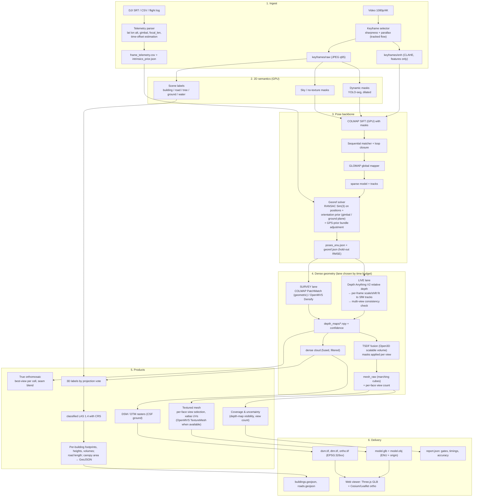

# Architecture v3: Single-Pass Drone Video to Georeferenced 3D (SIH 2026, PS 158 / SIH26158)

*Supersedes ARCHITECTURE.md (v2). Written 2026-09-26 after a full code and output audit of the current pipeline. Companion document: IMPLEMENTATION_PLAN.md.*

---

## 0. Why v2 did not produce usable results

The v2 design on paper is reasonable. The implementation never executed it, and the test inputs make a real 3D result impossible. Both facts must be fixed before any architecture change matters.

| # | Root cause | Evidence | Consequence |
|---|---|---|---|
| 1 | **Test videos contain no 3D information.** Both `test_data/flight.mp4` and `data_warehouse/warehouse_flight.mp4` are crops of a flat 2D drawing that scroll across the canvas. | `src/utils/generate_warehouse_flight.py:137` and `src/utils/generate_synthetic_test_data.py:67` copy a window out of a 2D image. Every frame is a pure translation of a plane. | Zero parallax. No SfM, MVS, or learned depth can recover structure from it. Any "3D" output is noise. |
| 2 | **No real pose estimation ever runs.** COLMAP and GLOMAP are not installed; the runner silently writes a straight-line synthetic trajectory. | `src/sfm/glomap_runner.py:190` (fallback still active) contradicts its own docstring at line 6 which says the fallback was "permanently removed". | Every downstream stage consumes fake poses. The Sim(3) fit reported scale 10.7 and 8.1 m RMSE on 9 frames, which is meaningless. |
| 3 | **Dense depth is geometrically wrong.** OpenCV `StereoSGBM` is run on raw consecutive frames, and depth is computed as `fx * baseline / disparity`. | `src/depth/depth_interface.py:81` and `:145`. | SGBM requires rectified pairs with horizontal epipolar lines. Drone motion is arbitrary, so the disparity has no metric meaning. |
| 4 | **Meshing turns a 2.5D surface into closed blobs.** Screened Poisson with tangent-plane normal orientation on an unoriented aerial cloud. | `src/mesh/mesh_generator.py:76` and `:86`. | Poisson closes the surface under the ground and around the edges. 200 k faces were generated from 40 k points, most of them hallucinated. Camera-based normal orientation was available and unused. |
| 5 | **"Texturing" is a thumbnail collage.** UVs are the mesh's XY bounding box; the atlas is a grid of resized keyframes. | `src/mesh/texture_mapper.py:121` and `:149`. See `runs/test_run/stage_07_mesh/textured_mesh.png`. | The mesh shows a 3 x 3 contact sheet stretched over it. This is the single most visible reason the final model looks unusable. |
| 6 | **Orthomosaic is not an orthomosaic.** The texture atlas is resized to 2048 px and saved as a TIFF with no CRS or geotransform. | `src/export/gis_exporter.py:39`. | Cannot be opened in QGIS as a georeferenced layer. |
| 7 | **Classifier is a per-point Python loop with heuristics.** 40 k points took 29 s; 15 M points would take hours. 95% of the "warehouse" scene was labelled vegetation. | `src/pointcloud/pointcloud_classifier.py:74`; `runs/test_run/audit_report.json` classification_metrics. | Cannot scale, and the labels are wrong. |
| 8 | **Measurements are fabricated.** Facility type is hardcoded; ground level is the 15th percentile of Z; footprint is a convex hull of "red" points. | `src/export/measurement_reporter.py:97`. Report claims 929,209 m² footprint and 776 m peak height. | Judges will check one number against reality. |
| 9 | **"Honest coverage" has no occlusion test.** It checks the angle between a face normal and a ray to 10 sampled cameras. | `src/utils/fallback_modes.py:52` and `:62`. | Faces under a roof are reported as observed. |
| 10 | **Contracts drift silently.** Mask back-projection in fusion accepts `mask_dir` and never uses it; the audit report is always `SUCCESS`. | `src/pointcloud/pointcloud_fusion.py:63`; `src/pipeline_runner.py:294`. | The pipeline cannot tell the operator when it has failed. |
| 11 | **Single-pass georeferencing is degenerate as designed.** Umeyama on camera centres only. A single straight pass gives near-collinear centres. | `src/georef/umeyama_aligner.py:77`. | Rotation about the flight line is unobservable from positions alone. The model's "up" direction is arbitrary, which breaks every height and DSM product. This is a design gap, not a bug. |
| 12 | **The development environment cannot run the design.** Python 3.14, CPU-only torch (`2.14.0+cpu`, `cuda.is_available() == False`) on a machine with an RTX 5050 and CUDA 13.3; no COLMAP, GLOMAP, OpenMVS, pycolmap, trimesh, rasterio, or pytest. WSL2 Ubuntu 22.04 and Docker Desktop are installed but unused. | `python -c "import torch; torch.cuda.is_available()"`; `pip list`. | YOLO masking ran on CPU (33 s for 9 frames). Nothing GPU-bound can be benchmarked. |
| 13 | CLAHE-enhanced frames are the only frames kept. | `src/ingest/keyframe_extractor.py:125`. | Good for SIFT, bad for MVS photo-consistency and for texture colour. Raw frames must be kept too. |

Everything below is designed so that these thirteen things cannot recur: real inputs, no silent fallbacks, geometry that is correct by construction, and quality gates that fail loudly.

---

## 1. Design principles

1. **Fail loudly, never fake.** Every stage emits a `gate.json` with pass/fail and metrics. A failed gate stops the run and the report says so. No synthetic poses, no placeholder textures.
2. **One pose backbone, two geometry lanes.** Camera poses always come from real SfM (COLMAP + GLOMAP). Dense geometry forks into a *Live* lane (learned monocular depth anchored to SfM, TSDF fusion) and a *Survey* lane (PatchMatch MVS). Both lanes produce the same artefacts so everything after them is shared.
3. **Per-frame depth maps are the central data structure.** Texturing, visibility, coverage, mask back-projection, semantic projection, orthomosaic, and DSM are all trivial once every keyframe has a pose, intrinsics, and a depth map. v2 had none of these because it built a point cloud and threw the per-view information away.
4. **2.5D products first, 3D products second.** DSM, DTM, and true orthomosaic are what GIS users measure on, and they are robust to single-pass coverage gaps. The textured mesh is the visualisation product on top.
5. **Georeferencing uses positions AND orientation priors.** Required for a single pass (root cause 11).
6. **Hold-out validation of accuracy.** Fit alignment on 80% of frames, report RMSE on the remaining 20%. Report metric accuracy against measured ground truth when available.
7. **Linux runtime, Windows dev.** The photogrammetry stack has first-class Linux support and CUDA builds on conda-forge. Run in WSL2 or a container; keep the Python code OS-neutral.

---

## 2. System overview



---

## 3. Stage specifications

Each stage lists: purpose, method, inputs, outputs, gate. Paths are relative to a run directory `runs/<run_id>/`.

### 3.1 Ingest and keyframe selection

**Purpose.** Produce 150 to 400 sharp, well-spaced keyframes and frame-accurate telemetry.

**Method.**
- Decode with ffmpeg (hardware decode when available) at a candidate rate of 4 to 6 Hz. Do not decode all frames with OpenCV.
- Score sharpness with Laplacian variance, normalised per clip (reject the bottom 15% rather than a fixed threshold; a fixed 20.0 fails on dark or low-contrast footage).
- **Parallax-driven selection.** Track sparse features (GFTT + pyramidal LK) from the last accepted keyframe. Accept a candidate when the median feature displacement exceeds a threshold (start at 5% of image width) or when the fraction of surviving tracks falls below 60%. This adapts to drone speed and altitude; fixed 2 Hz sampling either wastes frames on hover or breaks matching on fast passes.
- Save `raw/` (JPEG quality 95, original colour) and `enh/` (CLAHE on L channel) with identical filenames. Features use `enh/`; MVS, texturing, and orthomosaic use `raw/`.
- Telemetry parser supports DJI bracket SRT (current), DJI `FrameCnt/DiffTime` SRT with `[rel_alt: x abs_alt: y]` and `[focal_len: f]`, generic CSV, and Litchi/Airdata logs. Detect time-of-day timestamps and re-base. If the source is not frame-synced (external log), estimate the video-to-log time offset by cross-correlating image-motion speed with GPS ground speed.
- Intrinsics prior: from `focal_len` and sensor width when present, else from a per-model table (DJI Mini/Air/Mavic/Phantom), else from the video's horizontal FOV metadata. Written to `intrinsics_prior.json` and passed to COLMAP as the initial camera model.

**Outputs.** `01_ingest/raw/frame_%05d.jpg`, `01_ingest/enh/frame_%05d.jpg`, `01_ingest/frame_telemetry.csv`, `01_ingest/intrinsics_prior.json`, `01_ingest/gate.json`.

**Gate.** Keyframes ≥ 40; median inter-keyframe displacement within [3%, 15%] of width; telemetry covers ≥ 90% of keyframes.

### 3.2 2D semantics

**Purpose.** Masks for dynamic objects and sky, plus scene labels that later become 3D classes.

**Method.**
- Dynamic: YOLO-seg (Ultralytics, AGPL; swap to torchvision Mask R-CNN for commercial fielding). Classes person, bicycle, car, motorcycle, bus, truck, boat, animals. Dilate masks by 2% of width to cover motion blur halos.
- Sky and texture-less regions: a lightweight semantic model (SegFormer-B0 on ADE20K, or the same model as below) gives `sky`, `water`. Both are excluded from feature extraction and depth fusion. This matters for oblique gimbal angles, which are common in single-pass footage.
- Scene labels: one segmentation model per keyframe with classes {building, road, ground, vegetation, water, vehicle, other}. Options in order of preference: a model fine-tuned on aerial data (UAVid, LoveDA, or Potsdam), else Mask2Former/SegFormer ADE20K with class mapping. Labels are stored as uint8 PNG and projected to 3D in stage 3.6.

**Outputs.** `02_semantics/dynamic/*.png`, `02_semantics/sky/*.png`, `02_semantics/labels/*.png`, `02_semantics/gate.json` (per-class pixel share, GPU used yes/no).

**Gate.** Model ran on GPU (or explicit `--allow-cpu` flag). Masks exist for every keyframe.

### 3.3 Pose backbone: SfM

**Purpose.** Metric-up-to-scale camera poses and sparse tracks for every keyframe.

**Method.**
- `colmap feature_extractor` on `enh/` with `--ImageReader.mask_path` set to the union of dynamic and sky masks (COLMAP masks are 0 = ignore, so invert before writing). Camera model `OPENCV` for gimbal cameras (`SIMPLE_RADIAL` if the prior is weak), single camera, intrinsics initialised from `intrinsics_prior.json`.
- `colmap sequential_matcher` with overlap 15 and `loop_detection` enabled using a vocabulary tree (a lawnmower pass revisits neighbouring strips; loop closure is what makes the strips agree).
- `glomap mapper` for the global solve. Fallback to `colmap mapper` (incremental) only when GLOMAP registers fewer than 80% of frames, and record which was used.
- Read the model with `pycolmap` (not hand-written binary parsers) and export `poses.json` (name, qvec, tvec, camera id), `tracks.npz` (3D point, observing image ids, 2D keypoints).

**Outputs.** `03_sfm/database.db`, `03_sfm/sparse/0/`, `03_sfm/poses.json`, `03_sfm/tracks.npz`, `03_sfm/gate.json`.

**Gate.** Registered frames ≥ 80% of keyframes; mean reprojection error ≤ 1.0 px; a single connected model (no split components).

### 3.4 Georeferencing and metric scale

**Purpose.** A Sim(3) from SfM frame to local ENU with a defensible accuracy figure, robust to the single-pass degeneracy.

**Method.**
1. Convert telemetry to ENU about the first frame (pymap3d). Use `abs_alt` when present; otherwise `rel_alt` plus take-off altitude. Record which was used.
2. **Degeneracy check.** PCA of the SfM camera centres. If the second singular value is < 5% of the first, the trajectory is effectively a line and rotation about it is unobservable from positions alone. Log this and force step 4.
3. RANSAC Umeyama on camera centres (3-point minimal sample, 1.5 m inlier threshold scaled by the GPS quality field), then refit on inliers. Report RMSE on a 20% hold-out set of frames that were not used for the fit.
4. **Orientation prior.** Add a second residual term so the solve is well-posed on a straight pass:
   - If gimbal pitch/yaw and aircraft yaw are available: the camera's optical axis in ENU is known per frame; align the rotated SfM optical axes to them (weighted, robust).
   - Otherwise: fit the dominant plane through the sparse points labelled `ground`/`road` by the 2D semantics projection, and constrain its normal to ENU up. Heading is then fixed by the GPS track direction.
   Solve as a small non-linear least squares (scipy `least_squares`, 7 parameters) initialised from step 3.
5. **GPS-prior bundle adjustment** (COLMAP ≥ 3.11 supports position priors via the `pose_priors` table; verify flag names for the installed version). Run BA with per-frame ENU position priors and the sigma from the GPS quality. This distributes GPS error across the trajectory instead of leaving it as a rigid residual. If the installed COLMAP lacks it, skip and note in the report.
6. Write `georef.json`: scale, rotation, translation, ENU origin, UTM EPSG, RMSE (fit and hold-out), per-axis RMSE, degeneracy flag, method used, and the transform as a 4 x 4 matrix.

**Outputs.** `04_georef/georef.json`, `04_georef/poses_enu.json`, `04_georef/gate.json`.

**Gate.** Hold-out RMSE ≤ 3 m for consumer GPS, ≤ 0.3 m for RTK; up-vector agreement with the ground-plane normal within 3°.

### 3.5 Dense geometry: two lanes, one contract

Both lanes must write the same artefacts: `05_depth/depth/frame_%05d.npy` (float32 metres, ENU-scaled), `05_depth/conf/frame_%05d.npy` (0..1), and `05_depth/gate.json`.

**LIVE lane (default, target ≤ 3 min for 300 frames on an 8 GB GPU).**
1. Depth Anything V2 (Large, fp16) relative inverse depth per keyframe at 518 px on the long side. Do not use the "metric" variants: their training domains (indoor, driving) do not cover 50 to 120 m altitude and they clip at 80 m. Relative depth plus a per-frame fit is correct here.
2. Per-frame scale and shift: least squares (with RANSAC) between predicted inverse depth and the inverse depth of the frame's SfM track points (from `tracks.npz`). Typically 200 to 2000 anchors per frame. Reject frames with < 30 anchors or fit residual > 10%.
3. Multi-view consistency: for each frame, project its depth into the two nearest neighbours and compare against their depth. Pixels with relative error > 5% get confidence 0. This removes the classic monocular artefacts (edge halos, sky, repeated textures).
4. Optional refinement: one round of guided filtering of the depth using the image edges, or replace step 1 with a multi-view feed-forward model (VGGT or MapAnything) when a 16 GB GPU is available. Treat that as an experiment with a gate, not a dependency. Check model licences before fielding (VGGT weights are non-commercial unless the commercial release is used).

**SURVEY lane (quality, offline).**
- `colmap image_undistorter` on `raw/`, `patch_match_stereo` with `geom_consistency 1` and `max_image_size` chosen by VRAM (1600 px for 8 GB), then read the geometric depth maps directly as the lane output. `stereo_fusion` provides the dense cloud. OpenMVS `DensifyPointCloud` is an accepted substitute when the binary exists; convert its depth maps to the same `.npy` contract.

**Fusion (shared).**
- Open3D `ScalableTSDFVolume` integration of every depth map with its ENU pose, voxel 0.10 m (LIVE) or 0.05 m (SURVEY), truncation 4 voxels, dynamic and sky masks applied to each depth map before integration. This is how mask back-projection actually happens; no separate point-filter pass is needed.
- Marching cubes gives `mesh_raw.ply`. Because TSDF only carves observed space, the mesh has no under-ground shell and no Poisson blobs. Store per-vertex integration count as `view_count`.
- Fused point cloud from the TSDF (or `stereo_fusion` output in SURVEY) with voxel downsample + statistical outlier removal for the LAS product.

**Gate.** ≥ 90% of registered frames have an accepted depth map; median multi-view agreement ≥ 85%; mesh has one dominant component holding ≥ 90% of faces.

### 3.6 Products

**DSM / DTM.** Rasterise the fused cloud in ENU at a GSD of 2 to 3 x the mean point spacing (max Z per cell, hole-fill by IDW). Ground points from Cloth Simulation Filter (`cloth-simulation-filter` PyPI) give the DTM. Write GeoTIFF with rasterio, CRS = UTM zone of the origin, geotransform from the ENU origin.

**True orthomosaic.** For each DSM cell, back-project its 3D point into candidate cameras, keep those where the camera's depth map agrees within tolerance (visibility test), pick the camera with the smallest view angle to nadir and no dynamic mask hit, sample colour from `raw/`. Blend seams with a distance-weighted feather or multi-band blending. This yields a real orthophoto, not a resized atlas.

**Textured mesh.**
- Preferred: OpenMVS `TextureMesh` with masks when available.
- Built-in: per-face best-view selection using the depth-map visibility test, view angle, pixel footprint, and mask status; smooth the labelling with a graph cut or simple neighbour majority to reduce seams; UV atlas by `xatlas`; rasterise each atlas texel by projecting its 3D position into the chosen view. Colour-balance per view against the orthomosaic to hide exposure changes.
- Export `model.glb` (trimesh) with an `extras.enu_origin` block, and `model.obj/.mtl/.png`. The GLB is what the viewer loads; a 20 MB OBJ over HTTP is why the current viewer is slow.

**3D classification.**
- Project each dense point into the frames that see it (depth-map visibility) and vote on the 2D scene labels. Combine with geometry: height above DTM, planarity, verticality, computed vectorised (Open3D covariance estimation + batched `np.linalg.eigh`).
- Rules on top of the vote: `building` requires HAG > 2.5 m and planarity or verticality; `vegetation` requires scattering or the 2D vote; `road` is ground with the 2D `road` vote; everything else ground. ASPRS codes 2, 3/5, 6, 11, 9 (water), 64 (vehicle, when kept for analytics only).
- Write LAS 1.4 point format 7 with RGB, classification, and a CRS VLR (`laspy` `header.add_crs`).

**Measurements.**
- Building instances: connected components of the `building` class on the DSM grid (not convex hull of points). Footprint as a concave hull (alpha shape) in UTM; area, perimeter; height statistics relative to the DTM under the footprint (eave = 20th percentile, ridge = 95th of the median-filtered nDSM); volume = ∑ (DSM − DTM) × cell area over the footprint.
- Roads: skeletonise the `road` mask on the grid for centreline length; width from distance transform.
- Vegetation: canopy area and mean height.
- Export `buildings.geojson`, `roads.geojson` (EPSG:4326) and `measurements.csv`. No hardcoded facility names.

**Coverage and uncertainty.**
- Per face: number of views that see it (visibility via depth maps), max triangulation angle, and mean depth confidence. Faces with 0 views are flagged, not deleted; the viewer shows them in a hatch colour. The honest coverage metric is the area-weighted fraction of faces with ≥ 2 views and ≥ 3° triangulation angle.
- Export `coverage.json` plus a per-vertex attribute in the GLB.

### 3.6b Completion of unobserved surfaces

A single pass sees roofs and at most one or two facades. The PS asks for a model that is usable for measurement *and* visualisation, so completion is a ladder: each rung is used only where the one above it has no data, and every face carries a provenance tag (`observed`, `inferred`, `generated`) that the viewer can toggle and the measurement products respect.

| Tier | Method | Provenance | Used for measurement | Status |
|---|---|---|---|---|
| 0 | Capture it: one oblique orbit, or gimbal at −45° instead of nadir on the pass | observed | yes | flight guidance card |
| 1 | Footprint extrusion: roof from the DSM, vertical walls from the roof boundary to the DTM | roof observed, walls inferred | yes (footprint, heights, volume) | implemented, `src/completion/extrusion.py` |
| 2 | Wall texture: mirror the observed facade of the same building; street-level imagery where it exists; diffusion texturing (Hunyuan3D-Paint, Paint3D, FLUX Fill on a facade unwrap) | generated | no | Phase 2 |
| 3 | Per-building image-to-3D (Hunyuan3D 2.x, TRELLIS) aligned by ICP to the observed roof and facade | generated | no | Phase 4, hero buildings only |
| 4 | Gaussian splatting on the same poses for photoreal fly-through; diffusion repair of far-side views (Difix3D+) | generated | no | Phase 4 demo |

Tier 1 method: nDSM = DSM − DTM; components with nDSM ≥ 2.5 m and area ≥ 25 m²; trees rejected by median surface roughness; outer contour simplified to a polygon in UTM; constrained Delaunay triangulation, midpoint-subdivided, heights sampled from a roof-only DSM so gables survive; one vertical quad per roof boundary edge down to the DTM, sharing the roof boundary vertices so roof and walls are watertight. Output: `buildings_lod2.ply` (faces coloured by provenance), `buildings_face_provenance.npy`, `buildings.geojson` (footprint, area, perimeter, eave = 20th percentile nDSM, ridge = 95th of the median-filtered nDSM, volume, observed-roof fraction).

Point-cloud and scene completion networks (PoinTr, SnowflakeNet, MonoScene) are trained on objects or street scenes and do not transfer to aerial buildings, so they are not on the ladder. Licences to check before fielding: Hunyuan3D (Tencent community licence, regional restrictions), TRELLIS (MIT), VGGT (non-commercial weights).

### 3.7 Orchestration and delivery

- `pipeline.py --config run.yaml --profile live|survey --until <stage>`. Stages declare inputs and outputs; a stage is skipped when its outputs exist and its inputs' hashes match (`stage.done` files). This is what makes iteration on texturing not re-run SfM.
- Time-budget controller: after SfM, estimate the remaining time from measured per-frame throughput. If the SURVEY lane would exceed the budget, switch to LIVE and record the decision.
- `status.json` updated after every stage with stage, percent, elapsed, and gate outcome; the web API serves it.
- `report.json` replaces `audit_report.json`: status is `SUCCESS` only when every gate passed; otherwise `PARTIAL` or `FAILED` with the first failing gate named.
- Web app: FastAPI upload/status/results as now, plus a Three.js GLB viewer with coverage overlay and a Leaflet/Cesium map that drapes `ortho.tif` (served as web tiles or a COG) with building footprints.

---

## 4. Problem-statement challenge map

| PS challenge | v3 mitigation | Where |
|---|---|---|
| Limited viewing angles (single path) | TSDF only reconstructs observed space; orientation prior fixes the unobservable roll; coverage attribute marks unseen faces; 2.5D DSM/ortho products do not need side views | 3.4, 3.5, 3.6 |
| Motion blur, compression | Per-clip sharpness normalisation; parallax-based selection avoids redundant blurry frames; masks dilated for blur halos | 3.1, 3.2 |
| Illumination and shadows | CLAHE for features only; per-view colour balancing against the orthomosaic during texturing; multi-band seam blending | 3.1, 3.6 |
| Dynamic objects | Masks at feature extraction, per-view depth integration, texturing, and orthomosaic view selection | 3.2, 3.5, 3.6 |
| GPS noise | RANSAC Sim(3), GPS-prior bundle adjustment, hold-out RMSE reported | 3.4 |
| Near-real-time | LIVE lane: learned depth + TSDF, GPU throughout, stage caching, time-budget controller | 3.5, 3.7 |
| Occluded surfaces | Not hallucinated; flagged with view count; measurement uses DSM/DTM which are well-defined under occlusion | 3.5, 3.6 |
| Metric accuracy without GCPs | Telemetry-only alignment with orientation prior; accuracy validated on held-out frames and on measured objects | 3.4, evaluation |

---

## 5. Desired output and evaluation criteria (fills the placeholder in the PS)

| Output | Format | Acceptance target (consumer GPS / RTK) | How measured |
|---|---|---|---|
| Camera trajectory | poses_enu.json | ≥ 80% frames registered, reproj ≤ 1 px | SfM gate |
| Georeferencing | georef.json | hold-out RMSE ≤ 3 m / ≤ 0.3 m; up within 3° | 20% held-out frames; ground-plane normal |
| Dense cloud | LAS 1.4 with CRS | ≥ 50 pts/m² at 60 m AGL (LIVE), ≥ 200 (SURVEY) | density on DSM grid |
| Textured mesh | GLB + OBJ | one component ≥ 90% faces; no faces with 0 views unflagged | mesh gate, coverage |
| DSM / DTM / ortho | GeoTIFF, UTM | GSD ≤ 5 cm at 60 m AGL (4K); opens in QGIS with correct CRS | rasterio metadata check |
| Classification | ASPRS codes | ≥ 85% mean IoU on labelled test clips | UAVid-style labels projected to 3D |
| Measurements | GeoJSON + CSV | building height within 3% / 1%, footprint area within 5% / 2% of tape/plan | ground-truth objects in team flight |
| Coverage | coverage.json, GLB attribute | reported, not targeted | area-weighted |
| Time | report.json | ≤ 10 min LIVE, ≤ 30 min SURVEY for a 3 min 4K clip on an 8 GB laptop GPU | wall clock per stage |

---

## 6. Runtime environment

| Layer | Choice | Reason |
|---|---|---|
| OS runtime | WSL2 Ubuntu 22.04 (already installed) or Docker with GPU | CUDA COLMAP/GLOMAP/OpenMVS are packaged for Linux; Windows builds are manual |
| Python | 3.11 via conda | pycolmap, open3d, rasterio, laspy, xatlas all ship wheels for 3.11; 3.14 does not have them |
| SfM | conda-forge `colmap` (CUDA build) + conda-forge `glomap`; `pycolmap` from pip | no source builds on the critical path |
| MVS | COLMAP PatchMatch (bundled); OpenMVS from conda-forge if available | SURVEY lane |
| Deep models | torch CUDA build, `transformers` for Depth Anything V2, `ultralytics` for YOLO-seg | must verify `torch.cuda.is_available()` at startup and fail if false without `--allow-cpu` |
| Geo | pymap3d, pyproj, rasterio, laspy, shapely, `cloth-simulation-filter` | standard |
| Mesh | open3d, trimesh, xatlas | TSDF, GLB export, UV atlas |
| Demo box | Same container image on the laptop; cached results on USB as contingency | judges' venue has no reliable network |

Windows note (verified 2026-09-26 on the team laptop): Windows Application Control blocks the native DLLs of pycolmap and rasterio (`DLL load failed ... An Application Control policy has blocked this file`). Do not try to bypass the policy. Run the pipeline in WSL2, where `scripts/setup_env.sh` installs COLMAP 4.0.4 (CUDA 12.9 build) from conda-forge. Pure-Python stages and their unit tests still run on Windows.

Licensing note carried over from v2: Ultralytics and OpenMVS are AGPL. Both are called as subprocesses or replaceable modules; swap before commercial deployment.

---

## 7. Data contract (run directory)

```text
runs/<run_id>/
├── run.yaml                         # frozen config for reproducibility
├── status.json                      # live progress
├── report.json                      # gates, timings, accuracy, decisions
├── 01_ingest/   raw/ enh/ frame_telemetry.csv intrinsics_prior.json gate.json
├── 02_semantics/ dynamic/ sky/ labels/ gate.json
├── 03_sfm/      database.db sparse/0/ poses.json tracks.npz gate.json
├── 04_georef/   georef.json poses_enu.json gate.json
├── 05_depth/    depth/ conf/ lane.txt gate.json
├── 06_fusion/   tsdf_mesh_raw.ply dense_filtered.ply gate.json
├── 07_products/ dsm.tif dtm.tif ortho.tif classified.las
│                model.glb model.obj model.mtl model.png
│                buildings.geojson roads.geojson measurements.csv coverage.json
└── deliverables/  (copies of 07_products + report.json + a README for the recipient)
```

---

## 8. What is kept from v2

- Stage ordering and the run-directory idea.
- Umeyama closed-form as the initialiser (`umeyama_alignment` is correct and unit-tested; it only needs RANSAC and the orientation term around it).
- The FastAPI job model and the Three.js viewer shell.
- The YOLO mask generator (add dilation, GPU enforcement).
- The DJI SRT parser (extend formats, add offset estimation).
- The four-person workstream split (see IMPLEMENTATION_PLAN.md).

Everything in `src/depth/depth_interface.py::FastDepthEngine`, `src/mesh/texture_mapper.py`, the orthomosaic writer, the classifier loop, and the measurement heuristics is replaced rather than patched.
