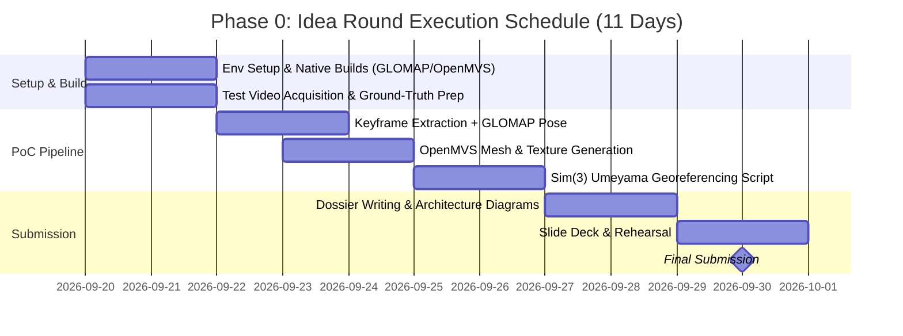

# Phase-Wise Project Execution Plan: SIH26158

**Team Roles, Workstream Breakdown, Sprint Milestones, and Stage Deliverables**  
*Problem Statement: SIH26158 — Drone 3D Reconstruction | Team Size: 4 Engineers*

---

## 👥 1. Team Organization & Workstream Allocation

To prevent merge conflicts, blocking dependencies, and integration bottlenecks, the 4 team members are organized into specialized workstreams with rigid interface contracts:

```
┌────────────────────────────────────────────────────────────────────────────────────────┐
│                               TEAM LEAD & ORCHESTRATION                                │
│       Manages overall DAG execution, CLI driver script, and time-budget telemetry      │
├──────────────────────────┬──────────────────────────┬──────────────────────────────────┤
│ Workstream A (Member 1)  │ Workstream B (Member 2)  │ Workstream C (Member 3)          │
│ Ingest, Filter & Masking │ Pose, SfM & Georeference │ Depth & Geometric Meshing        │
├──────────────────────────┼──────────────────────────┼──────────────────────────────────┤
│ • Video decode & keyframe│ • COLMAP feature match   │ • Dual-branch depth interface    │
│   scoring (Laplacian)    │ • GLOMAP global mapper   │ • OpenMVS DensifyPointCloud      │
│ • DJI SRT/GPS parser     │ • 7-DoF Umeyama Sim(3)   │ • Depth Anything V2 metric       │
│ • YOLOv8-seg dynamic     │   solver & RMS logger    │ • Open3D fusion & filter         │
│   mask generation        │ • Transform application  │ • OpenMVS Reconstruct & Texture  │
├──────────────────────────┴──────────────────────────┴──────────────────────────────────┤
│ Workstream D (Member 4) - Classification, Web Demo & Analytics                         │
│ • OpenPointClass ASPRS semantic classification (Ground, Building, Veg, Road)           │
│ • FastAPI upload, status polling & asynchronous job runner                             │
│ • CesiumJS / Potree 3D Tiles web visualizer                                            │
│ • PDAL / Shapely building footprint and height measurement reports                     │
└────────────────────────────────────────────────────────────────────────────────────────┘
```

---

## 📅 2. Phase-by-Phase Roadmap

### 🏁 Day 0 — Environment Setup & Baseline Validation
- **Target**: Working development environment and verified test footage on at least one GPU workstation.
- **Tasks**:
  1. Initialize Conda environment:
     ```bash
     conda create -n drone3d python=3.10 -y && conda activate drone3d
     conda install -c conda-forge colmap pdal gdal pyproj -y
     pip install ultralytics open3d pymap3d numpy scipy laspy fastapi uvicorn shapely
     ```
  2. Build native components from source against installed COLMAP:
     - Compile **GLOMAP** (`colmap/glomap`)
     - Compile **OpenMVS** (`cdcseacave/openMVS`)
  3. Acquire development test dataset:
     - **Priority 1**: Team-recorded drone clip (1–3 minutes, 4K/1080p) with embedded DJI SRT subtitle metadata.
     - **Priority 2**: OpenDroneMap (ODM) sample aerial dataset with known camera coordinates.
     - **Priority 3**: Creative-Commons drone flyover video + synthesized approximate GPS track.
- **Deliverable**: All 4 developers capable of importing dependencies; test video stored in shared Google Drive / S3 bucket.

---

### 🚀 Phase 0: Idea Round Sprint (Now $\to$ 2026-09-30)
**Primary Objective**: Deliver one genuine, proof-of-concept 3D render and an empirically measured georeferencing RMS error for the SIH Idea Round submission dossier. Reviewers favor demonstrated results over conceptual slides.



- **Days 1–2 (Environment & Ingest Baseline)**:
  - Verify CUDA toolchains on GPU machine (local or Kaggle T4x2 / RunPod).
  - Verify GLOMAP build passes `glomap mapper --help`.
- **Days 3–5 (First End-to-End Render)**:
  - Run manual command chain on 1-minute test clip:
    $$\text{Keyframes} \longrightarrow \text{COLMAP Features} \longrightarrow \text{GLOMAP Pose} \longrightarrow \text{OpenMVS ReconstructMesh} \longrightarrow \text{TextureMesh}$$
  - Skip semantic classification and georeferencing for now.
  - **Milestone Outcome**: Capture high-resolution screenshots of the textured OBJ mesh in Blender/MeshLab.
- **Days 6–7 (Sim(3) Georeferencing Proof)**:
  - Execute 7-DoF Umeyama script matching GLOMAP camera centers against parsed telemetry coordinates.
  - Calculate and log RMS error: *"We measured 4.2m RMS error and understand the GPS dilution of precision"* provides immediate jury credibility.
- **Days 8–9 (Submission Dossier Assembly)**:
  - Incorporate architecture diagrams, Falkingham benchmark critique, and actual PoC renders into the proposal.
  - Highlight the OpenPointClass differentiator and dual-branch time-budget defense.
- **Days 10–11 (Rehearse & Submit)**:
  - Polish PDF documentation, review compliance with SIH26158 guidelines, and submit ahead of the deadline.

---

### ⚙️ Phase 1: Core Pipeline & Workstream Integration (Build Weeks 1–2)
**Primary Objective**: Build a headless, modular Python CLI driver where passing raw video and telemetry outputs `georef.json` and a sparse point cloud with verified RMS error under 3 minutes.

#### Workstream A Tasks (Member 1)
- Build `src/01_ingest/keyframe_extractor.py`:
  - Decodes video candidates at 2 Hz via OpenCV/FFmpeg.
  - Implements Laplacian variance blur filtering ($\sigma_L^2 > \tau$).
  - Extracts top 400–600 frames.
- Build `src/01_ingest/srt_parser.py`:
  - Regex parser for DJI `.srt` files extracting: `Timestamp`, `Latitude`, `Longitude`, `Altitude`, `GimbalPitch`.
  - Interpolates coordinates to match extracted keyframe timestamps.
- Build `src/02_masking/mask_generator.py`:
  - Runs `yolov8-seg` inference over kept keyframes.
  - Exports single-channel binary masks (0 = background, 255 = dynamic object).
- **Workstream Output Contract**:
  - `data/keyframes/frame_%05d.png`
  - `data/masks/frame_%05d.png`
  - `data/frame_gps.csv`

#### Workstream B Tasks (Member 2)
- Build `src/03_sfm/glomap_runner.py`:
  - Subprocess wrapper for COLMAP feature extraction with `--ImageReader.mask_path` pointing to Workstream A's masks.
  - Sequential feature matcher with 10-frame window.
  - GLOMAP global bundle adjustment mapper.
- Build `src/04_georef/umeyama_aligner.py`:
  - Reads `images.bin` (camera centers) and `frame_gps.csv`.
  - Converts WGS84 coordinates to local ENU using `pymap3d`.
  - Solves 7-DoF similarity transform $s, \mathbf{R}, \mathbf{t}$ via Umeyama SVD.
  - Writes `georef.json` containing transformation matrix and RMS error metric.

#### 🚩 End-of-Week 2 Integration Checkpoint
- Workstream A's output directory feeds Workstream B's input without manual intervention.
- One terminal command executes Stages 1 through 6:
  ```bash
  python src/pipeline_runner.py --video input/test_flight.mp4 --telemetry input/test_flight.srt --stage 1-6
  ```
- Automated validation test verifies `georef.json` is generated with `rms_error_meters` reported.

---

### 💎 Phase 2: Geometry & Mesh Engine (Build Weeks 3–4)
**Primary Objective**: End-to-end execution produces a watertight, georeferenced, textured `model.obj` in under 15 minutes on Fast Mode.

#### Workstream C Tasks (Member 3)
- Build `src/05_depth/depth_interface.py`:
  - Abstract base class for depth prediction with two interchangeable backends:
    1. `FastDepthEngine`: Depth Anything V2 metric monocular inference / OpenCV SGBM stereo matching.
    2. `FullMVSEngine`: OpenMVS `DensifyPointCloud` subprocess call.
- Build `src/06_pointcloud/pointcloud_fusion.py`:
  - Open3D point aggregator.
  - Voxel downsampling ($0.05\text{m}$) and Statistical Outlier Removal.
  - Dynamic mask back-projection: removes 3D points that intersect dynamic vehicle masks in multiple views.

#### Workstream B Continuing Tasks (Member 2)
- Build `src/07_mesh/mesh_generator.py`:
  - Invokes OpenMVS `ReconstructMesh` on the fused point cloud.
  - Sets `RefineMesh` as optional flag (`--quality full`).
- Build `src/07_mesh/texture_mapper.py`:
  - Invokes OpenMVS `TextureMesh` passing original keyframes and dynamic masks to ensure clean road surfaces.
- Apply `georef.json` transform to `model.obj` vertices to generate `model_georeferenced.obj`.

#### ⏱️ Time Budget Calibration Sprint (End of Week 4)
- Benchmark real runs on target GPU workstation.
- Tune keyframe count ($N$) and depth resolution to guarantee:
  $$\text{Fast Mode Total Duration} \le 13 \text{ minutes}$$
- Integration test: A team member who did not author the code clones the repository, runs one command, and verifies the resulting textured mesh opens in MeshLab.

---

### 🏷️ Phase 3: Semantic Classification & Interactive Web Demo (Build Week 5)
**Primary Objective**: Automated ASPRS point cloud classification integrated into an interactive web viewer accessible to hackathon judges.

#### Workstream D Tasks (Member 4)
- Build `src/06_pointcloud/classifier.py`:
  - Integrates `OpenPointClass` / PDAL classification pipeline.
  - Assigns ASPRS standardized classification values:
    - Class 2: Ground
    - Class 3/5: Vegetation
    - Class 6: Building
    - Class 11: Road
  - Exports `classified.laz`.
- Build `src/08_export/gis_exporter.py`:
  - PDAL LAS/LAZ writer with spatial reference system tagging (`EPSG:326XX`).
  - GDAL orthomosaic raster generator (`orthomosaic.tif`).
- Build Web Platform (`webapp/`):
  - **Backend (FastAPI)**:
    - `POST /api/upload`: Accepts video and telemetry files.
    - `GET /api/status/{job_id}`: Real-time progress bar tracking stages 1–12 with wall-clock logging.
    - `GET /api/results/{job_id}`: Serves final assets.
  - **Frontend (CesiumJS / Potree)**:
    - 3D interactive viewer displaying the reconstructed textured mesh and classified point cloud geolocated on satellite base maps.

#### 🧪 Stress Testing Sprint
- Test against 3 distinct video datasets:
  1. Standard suburban flight (clean grid).
  2. High-traffic commercial road (heavy moving vehicles to stress test masking).
  3. Flight with erratic gimbal motion and variable tree canopy.
- Hardcode fault handling so missing frames or sensor dropouts do not crash the pipeline.

---

### 🏆 Phase 4: Measurement Analytics, Failures & Finale Rehearsal (Build Week 6)
**Primary Objective**: Solidify competition-winning differentiators, measurement reports, designed failure modes, and presentation rehearsals.

#### Key Engineering Deliverables
1. **Automated Analytics Report (`src/08_export/measurement_report.py`)**:
   - Uses PDAL and `Shapely` to calculate building rooftop polygon footprints ($\text{m}^2$) and structural heights ($\text{m}$) directly from the classified point cloud.
   - Answers the "+ measurements" criteria in the original SIH spec.
2. **Designed Failure Mode Demonstrations**:
   - **Scenario A (Loss of GPS/SRT Telemetry)**: Pipeline gracefully degrades to un-georeferenced metric reconstruction using visual baseline estimation rather than crashing.
   - **Scenario B (Heavy Occlusion)**: Surfaces not observed during the single flight pass are clearly delineated in an honest coverage report rather than smoothed over.
3. **Stage Rehearsal & Contingency Preparation**:
   - Screen-record a complete 12-minute execution from video upload to CesiumJS 3D rendering.
   - Prepare offline cached results on a USB drive in case venue Wi-Fi or on-stage GPU hardware fails.
   - Slide deck integration: Include live vs. full-quality benchmark graphs and real $\mathrm{Sim}(3)$ RMS error logs.

---

## 📋 3. Workstream Responsibility Matrix

| Stage | Responsible Member | Primary Tools | Input Artifact | Output Artifact | Definition of Done |
| :-: | :--- | :--- | :--- | :--- | :--- |
| **1** | **Member 1 (A)** | FFmpeg, OpenCV | `flight.mp4` | `keyframes/*.png` | 400–600 sharp frames extracted; blurry frames dropped ($\sigma_L^2$ check) |
| **2** | **Member 1 (A)** | Python regex | `telemetry.srt` | `frame_gps.csv` | Interpolated lat/lon/alt synchronized per frame |
| **3** | **Member 1 (A)** | YOLOv8-seg | `keyframes/` | `masks/*.png` | Single-channel 8-bit dynamic masks for all moving entities |
| **4** | **Member 2 (B)** | COLMAP | `keyframes/`, `masks/` | `database.db` | GPU SIFT features matched sequentially with loop closures |
| **5** | **Member 2 (B)** | GLOMAP | `database.db` | `sparse/0/*.bin` | Global bundle adjustment yields camera trajectory and sparse cloud |
| **6** | **Member 2 (B)** | pymap3d, scipy | `images.bin`, `frame_gps.csv` | `georef.json` | Closed-form $\mathrm{Sim}(3)$ matrix calculated with printed RMS error |
| **7** | **Member 3 (C)** | Depth Anything V2 / OpenMVS | `keyframes/`, `sparse/` | `dense_raw.ply` | Metric depth generated across all keyframes in <2 min (Fast Mode) |
| **8** | **Member 3 (C)** | Open3D | `dense_raw.ply`, `masks/` | `dense_filtered.ply` | Outliers pruned; dynamic artifacts removed via mask back-projection |
| **9** | **Member 2 & 3** | OpenMVS Reconstruct | `dense_filtered.ply` | `mesh_raw.ply` | Watertight Delaunay triangle mesh generated without holes |
| **10** | **Member 2 & 3** | OpenMVS Texture | `mesh_raw.ply`, `keyframes/` | `textured_mesh.obj` | UV texture map generated with multi-band seam leveling |
| **11** | **Member 4 (D)** | OpenPointClass | `dense_filtered.ply` | `classified.laz` | ASPRS standard classification completed in <2 minutes on CPU |
| **12** | **Member 4 (D)** | PDAL, GDAL | `textured_mesh.obj`, `georef.json` | `deliverables/*` | Model transformed to real CRS; GeoTIFF orthomosaic generated |
| **13** | **Member 4 (D)** | FastAPI, CesiumJS | `deliverables/*` | Live Web App | Upload $\to$ Processing $\to$ 3D visualizer operating smoothly |

---

## 🎯 4. Quality Control & Definition of Done (DoD)

Before any workstream merges code into `main`, the branch must satisfy the following criteria:

- [ ] **Contract Compliance**: Reads from and writes to the exact directories and schemas defined in [ARCHITECTURE.md](file:///d:/sih/ARCHITECTURE.md).
- [ ] **Timing Telemetry**: Every execution logs its wall-clock duration via Python's `time.perf_counter()` to standard output and `audit_report.json`.
- [ ] **Hardware Adaptability**: Runs seamlessly on a headless Linux/Windows machine with CUDA acceleration.
- [ ] **Headless Automation**: Requires zero GUI button clicks; fully executable via CLI arguments.
- [ ] **Graceful Exception Handling**: When input frames have no matches or telemetry packets drop, the module logs a warning and proceeds without throwing unhandled exceptions.

---
*Maintained by the SIH26158 Team. Consult [README.md](file:///d:/sih/README.md) for quickstart and [ARCHITECTURE.md](file:///d:/sih/ARCHITECTURE.md) for technical deep-dives.*
