<div align="center">

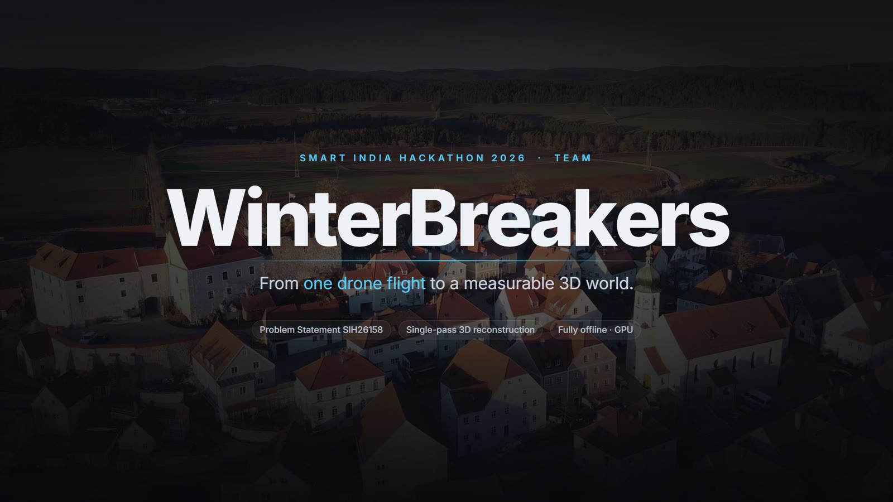

# WinterBreakers · Single-Pass Drone Video → Georeferenced 3D

**One continuous drone video in. A measurable 3D model and GIS-ready map layers out.**
**Fully offline, on a single laptop GPU.**

[](#)
[](#-the-problem)
[](#-quick-start)


</div>

---

<div align="center">

### ▶ The same flight, reconstructed as it plays

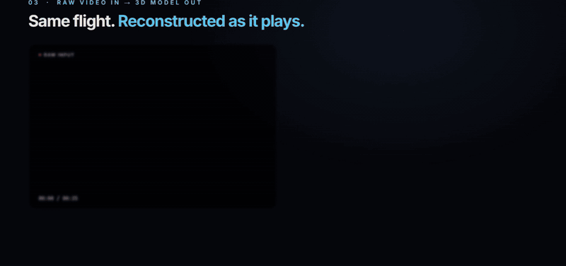

<sub>Left: the raw 25 s, 2720×1530 consumer-drone clip (one pass, no telemetry, no ground control points).
Right: the dense cloud growing camera by camera as each keyframe is registered: 23/23 poses, 446,683 points, 1.16 M-face mesh.
Every point and pose shown is a real pipeline output, replayed in sync with the video.</sub>

</div>

---

## At a glance

<table>
<tr>
<td align="center"><h3>4 min 38 s</h3><sub>end-to-end for a 25 s 2.7K clip<br>(RTX 5050 laptop GPU)</sub></td>
<td align="center"><h3>100 %</h3><sub>keyframes registered by SfM<br>in every real run</sub></td>
<td align="center"><h3>0.58 px</h3><sub>mean reprojection error<br>(gate: ≤ 1 px)</sub></td>
<td align="center"><h3>98.4 %</h3><sub>multi-view depth agreement<br>(Pi3X lane)</sub></td>
</tr>
<tr>
<td align="center"><h3>1.09 M</h3><sub>dense points from<br>a single pass</sub></td>
<td align="center"><h3>29–36</h3><sub>buildings extracted automatically<br>with heights and volumes</sub></td>
<td align="center"><h3>8 / 8</h3><sub>stage quality gates passed<br>in every run shown</sub></td>
<td align="center"><h3>0</h3><sub>ground control points,<br>re-flights or internet needed</sub></td>
</tr>
</table>

---

## Contents

- [The problem](#-the-problem)
- [What we built](#-what-we-built)
- [See it run](#-see-it-run)
- [How it works: the 8-stage pipeline](#-how-it-works-the-8-stage-pipeline)
- [Results on real footage](#-results-on-real-footage)
- [Deliverables](#-deliverables)
- [The Recon Board dashboard](#-the-recon-board-dashboard)
- [Quick start](#-quick-start)
- [Tuning a run](#-tuning-a-run)
- [Run directory and data contract](#-run-directory-and-data-contract)
- [Honesty by design](#-honesty-by-design)
- [Repository layout](#-repository-layout)
- [Testing](#-testing)
- [Tech stack](#-tech-stack)
- [Known limits and roadmap](#-known-limits-and-roadmap)
- [Who this is for](#-who-this-is-for)
- [Team](#-team)

---

## 🎯 The problem

> **SIH26158:** Turn *a single drone pass* into an accurate, georeferenced 3D model, in near-real-time.

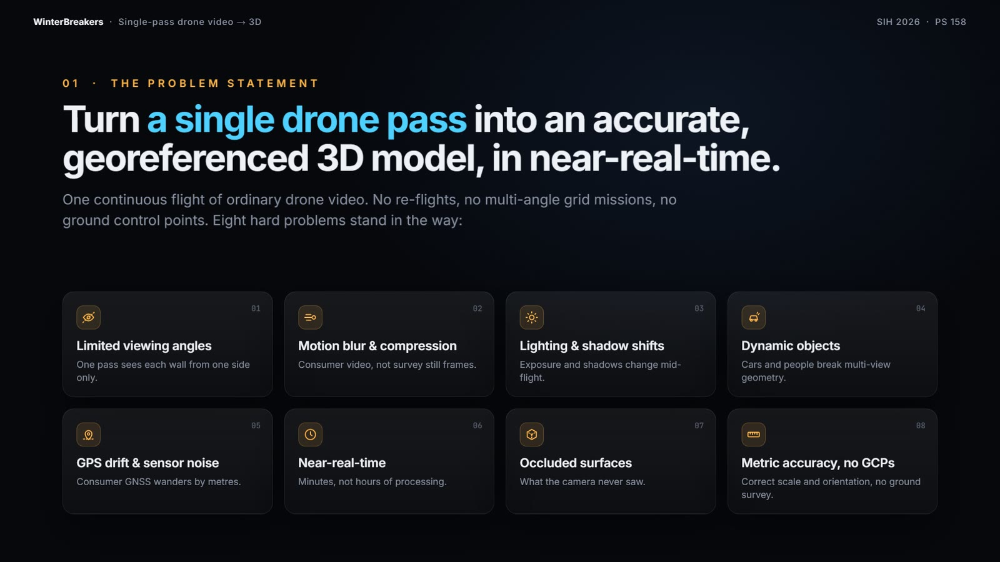

Conventional photogrammetry expects a planned grid mission (often flown twice, crossing, with 70–80 % overlap), surveyed ground control points, still photos from a good camera, and hours of desktop or cloud processing. In the field (a flood zone, a landslide, a border post, a collapsed building) you may get **one quick pass** with an ordinary drone, nobody can walk in to place markers, there may be no internet, and footage may not be allowed to leave the device.

The problem statement lists eight difficulties. Here is how each one is handled:

| # | Challenge | How the pipeline handles it | Stage |
|:-:|---|---|:-:|
| 1 | **Limited viewing angles** | TSDF fusion builds only what the cameras saw. An orientation prior fixes the tilt that a straight pass cannot resolve. DSM, DTM and orthomosaic are 2.5D and do not need side views. Unseen faces are flagged. | 4 · 6 · 8 |
| 2 | **Motion blur and compression** | Sharpness scored relative to each clip; motion-based keyframe selection avoids piling up blurry frames; masks dilated to cover blur halos. | 1 · 2 |
| 3 | **Lighting and shadows** | CLAHE contrast enhancement used for feature matching only, never for colour. Seams in texture and orthomosaic are blended. | 1 · 7 |
| 4 | **Moving objects** | YOLOv8-seg masks for people, vehicles, boats and animals, applied at feature matching, depth fusion, texturing and ortho view selection. | 2 |
| 5 | **GPS drift and sensor noise** | RANSAC Sim(3) fit to GPS, error reported on 20 % held-out frames. | 4 |
| 6 | **Near-real-time** | GPU at every heavy step, a fast LIVE lane, and stage caching so a re-run repeats only the stages whose inputs changed. | all |
| 7 | **Occluded surfaces** | Never faked. Every face carries a view count and a provenance label (observed / inferred / generated). | 6 · 8 |
| 8 | **Metric accuracy without GCPs** | Telemetry-only alignment plus a ground-plane or gimbal orientation prior; checked on held-out frames. | 4 |

---

## 🧭 What we built

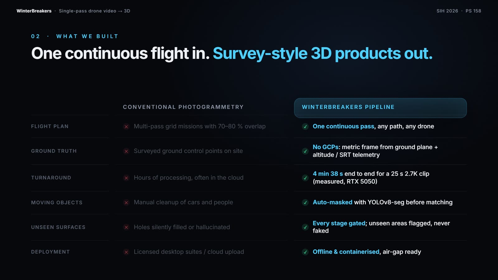

| | Conventional photogrammetry | **WinterBreakers pipeline** |
|---|---|---|
| **Flight plan** | Multi-pass grid, 70–80 % overlap | **One continuous pass**, any path, any drone |
| **Ground truth** | Surveyed ground control points | **No GCPs**: metric frame from ground plane + altitude / SRT telemetry |
| **Turnaround** | Hours, often on a cloud service | **Minutes on a laptop**: 4 min 38 s end-to-end for a 25 s 2.7K clip |
| **Moving objects** | Cleaned up by hand | **Auto-masked** with YOLOv8-seg before matching |
| **Unseen surfaces** | Hallucinated or silently filled | **Flagged and labelled**, never presented as measured |
| **Failure mode** | Silently degraded output | **Every stage gated**: fails loudly, names the stage and the reason |
| **Deployment** | Licensed desktop suite or cloud | **Offline Docker container**, air-gap ready; footage never leaves the machine |

Compared with recent research systems (neural fields, Gaussian splatting, feed-forward 3D models): those give attractive novel views but rarely produce **measurable, georeferenced outputs in standard GIS formats**, and usually need more GPU memory than a field laptop has. We use learned depth where it helps, but **anchor it to classical multi-view geometry**, so scale is right and every number traces back to the images.

---

## 🎬 See it run

### Under the hood, stage by stage

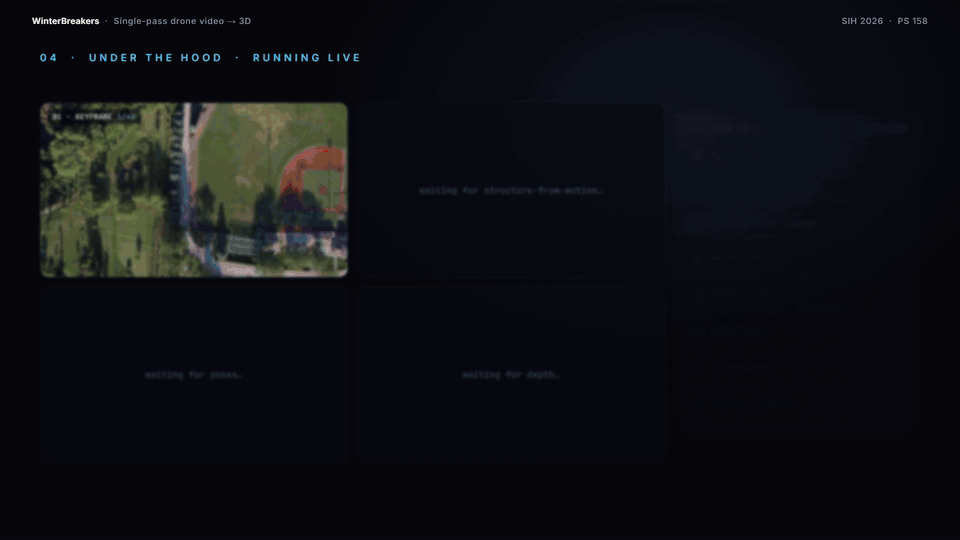

<sub>A 53 s nadir clip over a sports field, Pi3X quality lane. The four panels fill in as stages pass their gates:
**① keyframe** (46 picked from 267 candidates) → **② SfM feature tracks** (46/46 registered, 0.63 px) → **③ metric depth** (Pi3X on SfM poses, 98.4 % consistent) → **④ TSDF fusion** (2.78 M faces, 1.09 M points).
The side panel shows each stage's live gate status; the filmstrip is the selected keyframe set.</sub>

<table>
<tr>
<td width="50%" valign="top">

### Dense reconstruction, one pass

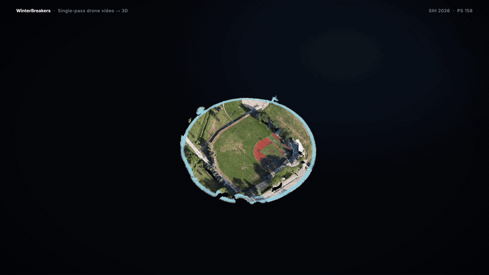

<sub>Orbit of the fused, coloured surface: 1,087,427 points from 46 camera poses covering about 24,000 m².</sub>

</td>
<td width="50%" valign="top">

### GIS products and buildings

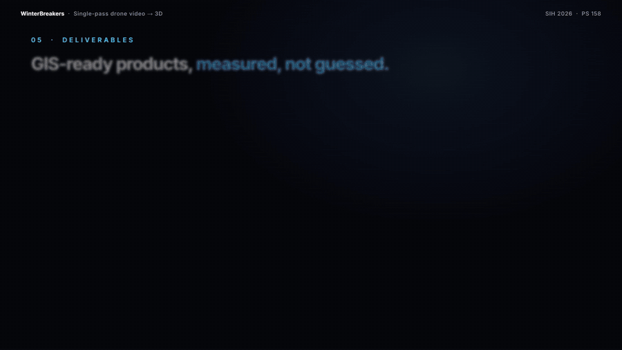

<sub>True orthomosaic, DSM hillshade and height-above-ground, then the town clip with 29 buildings extracted automatically, each with footprint, height and volume.</sub>

</td>
</tr>
</table>

---

## ⚙️ How it works: the 8-stage pipeline

```mermaid
flowchart LR
    subgraph IN["Input"]
        V["🎥 One drone video<br/>1080p / 2.7K / 4K"]
        T["🛰️ Telemetry (optional)<br/>DJI SRT · CSV · flight log"]
    end

    V --> S1["① Ingest &amp; keyframes<br/>sharpness + tracked-motion selection"]
    T --> S1
    S1 --> S2["② Dynamic masks<br/>YOLOv8-seg · GPU"]
    S2 --> S3["③ Structure-from-Motion<br/>COLMAP global mapper"]
    S3 --> S4["④ Metric frame<br/>RANSAC Sim(3) + ground-plane /<br/>gimbal orientation prior"]
    S4 --> S5["⑤ Dense depth<br/>LIVE: Depth Anything V2<br/>QUALITY: Pi3X · SURVEY: PatchMatch"]
    S5 --> S6["⑥ TSDF fusion<br/>Open3D · masks per view"]
    S6 --> S7["⑦ GIS products<br/>DSM · DTM · ortho · nDSM · LAS"]
    S7 --> S8["⑧ Buildings &amp; completion<br/>footprints · heights · volumes · LOD2"]

    S8 --> OUT["📦 GLB / OBJ · GeoTIFF · LAS 1.4<br/>GeoJSON · CSV · report.json"]

    classDef stage fill:#0f172a,stroke:#38bdf8,color:#e2e8f0
    classDef io fill:#1e293b,stroke:#f59e0b,color:#fde68a
    class S1,S2,S3,S4,S5,S6,S7,S8 stage
    class V,T,OUT io
```

Each stage writes to a fixed folder plus a `gate.json` that records whether it passed and the numbers behind that decision. **If a gate fails, the run stops and the report names the stage and the reason.** There is no fallback to a synthetic trajectory or made-up geometry.

<details open>
<summary><b>Stage-by-stage details</b></summary>

<br>

| Stage | What happens | Gate / key outputs |
|---|---|---|
| **① Ingest & keyframes** | ffmpeg decodes candidates at a few fps. Each is scored for sharpness against a clip-relative threshold, so dark footage is not rejected wholesale. A new keyframe is accepted only when tracked features show the scene has moved enough, which adapts to drone speed and height. Two copies are kept: CLAHE-enhanced for matching, original for colour. SRT/CSV telemetry is interpolated to each keyframe; intrinsics come from focal length + sensor or a drone-model table. | `raw/`, `enh/`, `frame_telemetry.csv`, `intrinsics_prior.json` |
| **② Dynamic masks** | YOLOv8-seg finds people, vehicles, bicycles, boats and animals; masks are dilated for motion blur and reused by every later stage. | one mask per keyframe |
| **③ Structure-from-Motion** | SIFT features with masks, sequential matching with loop detection, COLMAP global mapper, focal refinement. | ≥ 80 % registered, mean reprojection ≤ 1 px, one connected model |
| **④ Metric frame** | Similarity transform to local East-North-Up via RANSAC on GPS. Detects the degenerate straight-line case (roll about the flight line is unobservable) and adds a gimbal or ground-plane "up" prior. Without telemetry, scale comes from an operator-supplied altitude. | `georef.json`, `poses_enu.json`, hold-out RMSE |
| **⑤ Dense depth** | Per-keyframe depth in one of three lanes sharing one output contract. Learned depth is fitted to SfM points per frame (so it is in metres), then cross-checked against neighbouring views; disagreeing pixels get zero confidence. | `depth/*.npy`, `conf/*.npy`, acceptance ratio, consistency |
| **⑥ TSDF fusion** | Masked depth maps fused on GPU into a TSDF volume, marching-cubes surface, per-face view counts. Unlike Poisson, TSDF does not invent watertight blobs under the ground. | mesh, dense cloud, coverage (≥ 2 views) |
| **⑦ GIS products** | DSM (highest point per cell), DTM via cloth-simulation ground filter, nDSM = DSM − DTM. True orthomosaic built per cell with visibility checks and mask-aware best-view selection. | `dsm.tif`, `dtm.tif`, `ortho.tif`, `dense_cloud.las` |
| **⑧ Buildings & completion** | Connected nDSM regions ≥ 2.5 m tall and ≥ 25 m², trees rejected by roughness. Footprint, perimeter, eave and ridge height, volume against local terrain. Walls extruded from roof edges and labelled *inferred*; optional regularisation and façade details. | `buildings.geojson`, `buildings_lod2.glb`, `model_hybrid.glb` |

</details>

<details>
<summary><b>Three depth lanes, one contract</b></summary>

<br>

| Lane | Method | Speed | When to use |
|---|---|---|---|
| `live` (default) | Depth Anything V2 relative depth, per-frame scale/shift fit to SfM tracks, multi-view consistency filter | ⚡ fastest (≈ 32 s for 23 frames) | quick-look in the field |
| `pi3x` | Pi3X multi-view model conditioned on SfM poses, intrinsics and sparse depth | 🐢 ≈ 10 min for 46 frames | best accuracy on a laptop |
| `survey` | COLMAP PatchMatch multi-view stereo (CUDA only) | slow | classical reference, highest-trust geometry |

Everything after stage ⑤ is lane-agnostic, so lanes can be compared on the same poses.

</details>

The full design, with the reasoning behind every choice, is in [`ARCHITECTURE_V3.md`](ARCHITECTURE_V3.md). The build plan is in [`IMPLEMENTATION_PLAN.md`](IMPLEMENTATION_PLAN.md).

---

## 📊 Results on real footage

All numbers come from `runs/<id>/report.json` of real runs on real drone video, on a laptop with an RTX 5050 (8 GB). None are estimates.

| Metric | **Run A**: town, LIVE lane | **Run B**: sports field, Pi3X lane | **Run C**: town, Pi3X lane |
|---|:-:|:-:|:-:|
| Input | 25 s · 2720×1530 · oblique | 53 s · 832×464 · nadir | same as Run A |
| Keyframes | 23 of 125 candidates | 46 of 267 candidates | 23 of 125 candidates |
| SfM registered | **23 / 23** | **46 / 46** | **23 / 23** |
| Mean reprojection error | **0.58 px** | **0.63 px** | **0.58 px** |
| Sparse model | 10,801 pts · 96,092 obs | 18,464 pts · 104,361 obs | 10,801 pts |
| Depth maps accepted | 23 / 23 | 46 / 46 | 23 / 23 |
| Depth fit error (median) | 2.2 % | 0.2 % | 0.5 % |
| Multi-view depth agreement | 94.8 % | **98.4 %** | 96.7 % |
| Dense cloud | 446,683 pts | **1,087,427 pts** | 305,497 pts |
| Mesh | 1,155,798 faces | 2,776,574 faces | 898,951 faces |
| Surface area / seen by ≥ 2 views | ≈ 24,800 m² / 99.97 % | ≈ 24,000 m² / 100 % | ≈ 19,200 m² / 100 % |
| Orthomosaic filled (observed area) | 93 % @ 0.20 m | 97 % @ 0.20 m | 92 % @ 0.20 m |
| Buildings extracted | **29** | 1 (field scene) | **36** |
| Wall-clock, all 8 stages | **4 min 38 s** | ≈ 17 min (depth ≈ 10 min) | ≈ 9.4 min |
| Gates passed | 8 / 8 ✅ | 8 / 8 ✅ | 8 / 8 ✅ |

<details>
<summary><b>Run A, per-stage timing (25 s 2.7K clip, LIVE lane)</b></summary>

<br>

| Stage | Time | Key numbers |
|---|---:|---|
| ① Ingest & keyframes | 25.0 s | 23 keyframes from 125 candidates |
| ② Dynamic masks | 13.1 s | 23/23 frames, ≤ 4 % of any frame masked |
| ③ SfM | 65.5 s | 23/23 registered, 0.58 px, one model |
| ④ Metric frame | 0.2 s | ground plane 79 % inliers, 60 m altitude prior |
| ⑤ Dense depth | 31.8 s | 23/23 accepted, 94.8 % consistent |
| ⑥ TSDF fusion | 32.9 s | 1.16 M faces, 446 k points, largest component 100 % |
| ⑦ GIS products | 9.5 s | DSM / DTM / ortho at 0.20 m |
| ⑧ Buildings & completion | 99.9 s | 29 buildings, LOD2 + hybrid GLB |
| **Total** | **277.9 s** | |

</details>

> [!NOTE]
> **What these results do not show yet.** The test clips had no telemetry, so scale came from an assumed flight height and the models are in a local metric frame, not yet tied to real map coordinates. The georeferencing stage is built and unit-tested for the telemetry case, but a true accuracy figure in metres needs a flight with telemetry and tape-measured reference objects. That is the first item on the roadmap. We would rather say this plainly than show an accuracy number we have not measured.

---

## 🗺️ Deliverables

<table>
<tr>
<th width="33%">True orthomosaic + footprints</th>
<th width="33%">DSM hillshade</th>
<th width="33%">Height above ground (nDSM)</th>
</tr>
<tr>
<td>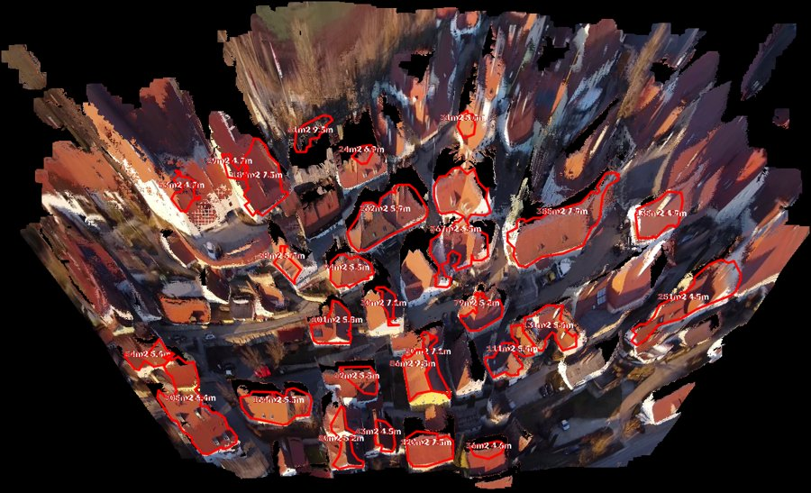</td>
<td>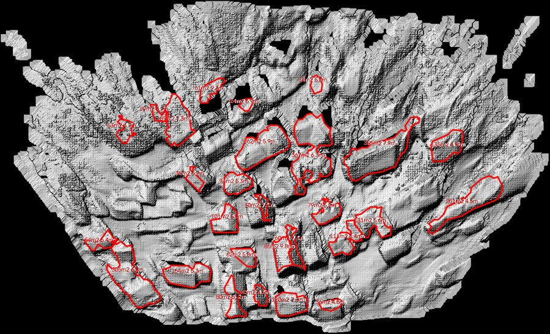</td>
<td>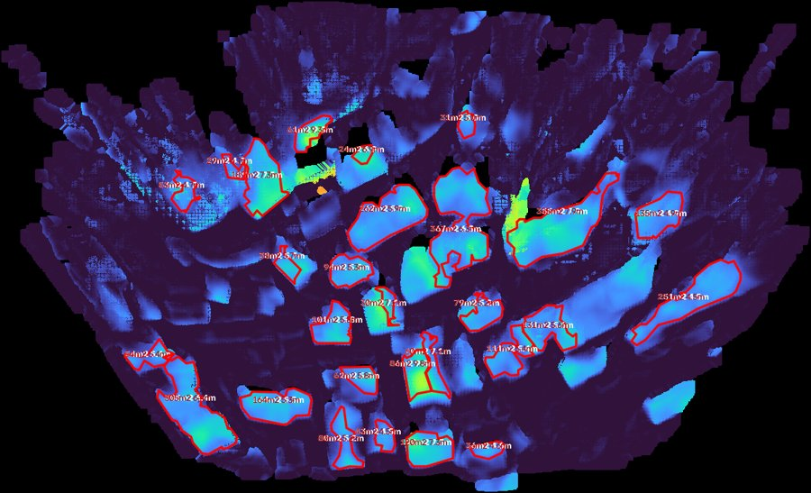</td>
</tr>
<tr>
<td>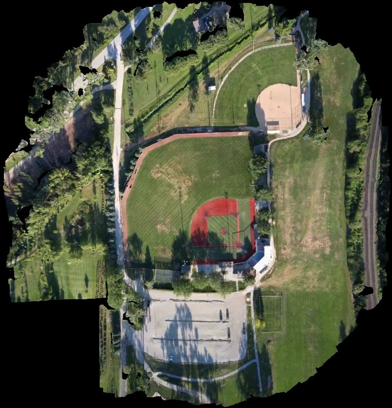</td>
<td>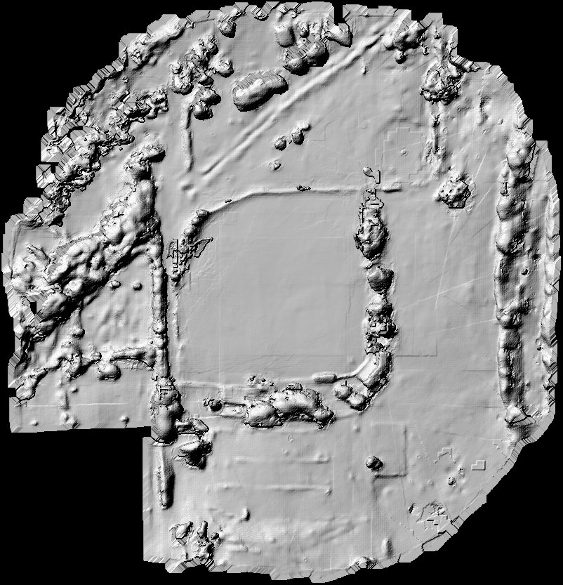</td>
<td>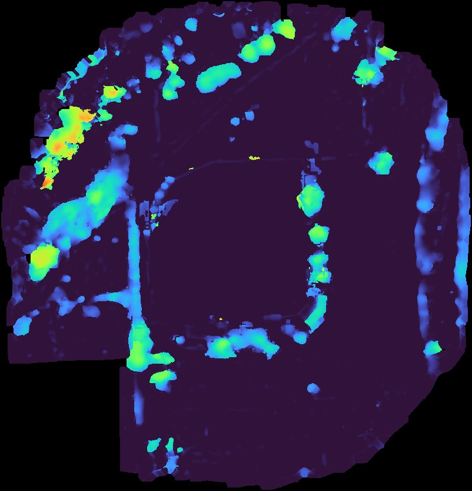</td>
</tr>
</table>

<sub>Top: Run A (town, LIVE lane), with each footprint labelled with area and height. Bottom: Run B (sports field, Pi3X lane). Black cells were never seen from this single pass and are left empty, not invented.</sub>

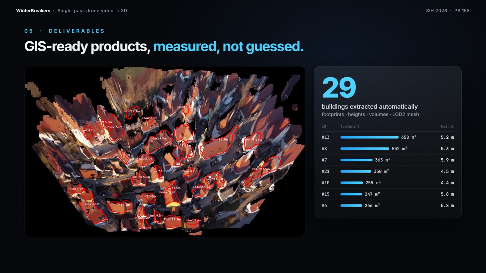

| Product | Format | Opens in |
|---|---|---|
| Textured 3D mesh (observed + inferred walls) | `GLB`, `OBJ` | Blender, three.js, any glTF viewer |
| Digital Surface Model / Digital Terrain Model | `GeoTIFF` | QGIS, ArcGIS, GDAL |
| True orthomosaic (per-cell best view, not a stretched photo) | `GeoTIFF` | QGIS, ArcGIS |
| Height above ground (nDSM) | raster + preview | QGIS |
| Classified dense point cloud | `LAS 1.4` with colour and class codes | CloudCompare, QGIS, PDAL |
| Buildings: footprint, perimeter, eave/ridge height, volume | `GeoJSON`, `CSV` | QGIS, pandas |
| LOD2 block models, regularised buildings | `GLB`, `PLY` | Blender, three.js |
| Coverage and provenance per face | `.npy` + GLB attribute | dashboard viewer |
| Run report: gates, timings, decisions | `report.json` | dashboard, any JSON tool |

---

## 🖥️ The Recon Board dashboard

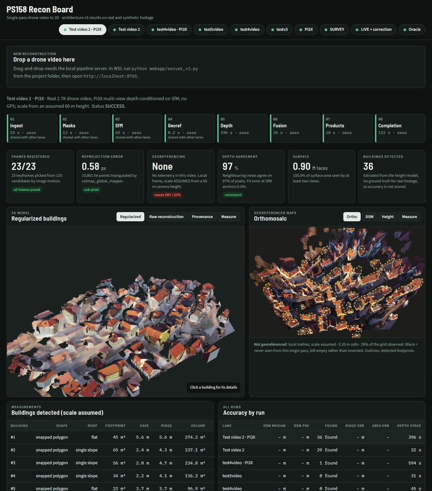

A single-page dashboard served by the container at **http://localhost:8765**:

- **Drag-and-drop upload** of a video (plus its DJI `.SRT`), with Fast / Balanced / Best presets and an Advanced panel
- **Live stage-by-stage progress**: every gate shows pass/fail, timing and its key numbers as the run proceeds
- **Metric cards**: frames registered, reprojection error, georeferencing status, depth agreement, surface size, buildings found
- **3D viewer** (three.js): regularised buildings, raw reconstruction, **provenance view** (observed / inferred / generated), and a measure tool; click a building for its details
- **Map panel**: orthomosaic, DSM and height layers with detected footprints and a measure tool
- **Building table** with shape, roof type, footprint, eave, ridge and volume, plus an **accuracy-by-run** comparison across lanes

A static copy with pre-computed runs lives at [`webapp/dashboard.html`](webapp/dashboard.html). Open it in a browser to explore without running anything.

---

## 🚀 Quick start

### Option 1: Docker (recommended, any OS)

```bash
git clone https://github.com/LazyBrain-spiral/summerbreak.git
cd summerbreak

# NVIDIA GPU (Linux, or Windows 10/11 with Docker Desktop + WSL2, driver >= 570)
docker compose up --build -d

# No NVIDIA GPU (macOS, CPU-only servers). Slower; the SURVEY lane is disabled
docker compose --profile cpu up --build -d app-cpu
```

Open **http://localhost:8765** and drop a video on the upload panel.

<details>
<summary><b>Offline / air-gapped use</b></summary>

<br>

Model weights (about 6.5 GB, of which Pi3X is 5 GB) download on first use into the `cache` volume. To fetch them up front:

```bash
docker compose run --rm app python scripts/prefetch_models.py            # all models
docker compose run --rm app python scripts/prefetch_models.py --no-pi3x  # skip Pi3X
```

Move to an air-gapped machine:

```bash
docker save ps158:latest | gzip > ps158.tar.gz
docker run --rm -v ps158_cache:/c -v "$PWD:/o" ubuntu tar czf /o/cache.tgz -C /c .
```

</details>

### Option 2: Native (Linux / WSL2 Ubuntu 22.04)

```bash
make env        # conda env with Python 3.11, CUDA torch, COLMAP 4.0.4 (see scripts/setup_env.sh)
make check      # verify GPU, COLMAP and model availability
make serve      # dashboard + upload server on :8765
```

> [!TIP]
> On Windows, run the pipeline inside **WSL2**. COLMAP, pycolmap and rasterio ship reliable CUDA builds for Linux; pure-Python stages and their unit tests still run on Windows.

### Command-line run

```bash
# LIVE lane (fast)
python -m src.pipeline --config configs/live.yaml \
    --video data/flight.mp4 --telemetry data/flight.SRT --run-id flight

# Pi3X quality lane
python -m src.pipeline --config configs/live.yaml \
    --video data/flight.mp4 --telemetry data/flight.SRT --run-id flight_pi3 \
    --set dense.predictor=pi3x

# Inside Docker (videos in ./data are mounted at /data)
docker compose run --rm app python -m src.pipeline --config configs/live.yaml \
    --video /data/flight.mp4 --telemetry /data/flight.SRT --run-id flight
```

### REST API

```bash
curl -F video=@flight.mp4 -F telemetry=@flight.SRT -F lane=pi3x -F detail=high \
     localhost:8765/api/runs              # start a run → returns its id
curl localhost:8765/api/runs/<id>         # stage-by-stage progress
curl localhost:8765/api/runs/<id>/data    # dashboard data for a finished run
curl localhost:8765/api/health            # GPU / environment status
```

---

## 🎛️ Tuning a run

The upload panel and `POST /api/runs` accept the same fields:

| Field | Values | Effect |
|---|---|---|
| `lane` | `live` · `pi3x` · `survey` | depth method: Depth Anything (fast), Pi3X multi-view (best accuracy), COLMAP PatchMatch (GPU only) |
| `detail` | `draft` · `standard` · `high` | TSDF voxel / DSM cell / texture texel: 30/40/10 cm · 15/20/6 cm · 10/10/4 cm |
| `keyframes` | `auto` · `dense` · `sparse` | dense helps slow or short clips, sparse suits long fast flights |
| `altitude_m` | 5 – 1000 | camera height used for scale when there is no telemetry |
| `min_building_m` | 1 – 20 | smallest height accepted as a building |
| `facades` · `regularize` · `texture` · `masks` · `vegetation` | `true` / `false` | doors and windows, straightened buildings, video textures, ignore cars and people, tree filter |

**Presets:** Fast = `live / standard / auto` · Balanced = `pi3x / standard / auto` · Best = `pi3x / high / dense`

Profiles live in [`configs/`](configs): `live.yaml` (target ≤ 10 min on an 8 GB GPU), `survey.yaml` (PatchMatch stereo) and `synth_oracle.yaml` (evaluation against ground truth). Any key can be overridden with `--set section.key=value`.

---

## 📁 Run directory and data contract

Every run is self-describing and reproducible:

```text
runs/<run_id>/
├── run_config.json        # frozen config for reproducibility
├── status.json            # live progress (polled by the dashboard)
├── report.json            # gates, timings, metrics, decisions
├── 01_ingest/             # raw/ + enh/ keyframes, frame_telemetry.csv, intrinsics_prior.json, gate.json
├── 02_masks/              # dynamic-object masks, gate.json
├── 03_sfm/                # COLMAP database, sparse/0/, poses, gate.json
├── 04_georef/             # georef.json, poses_enu.json, gate.json
├── 05_depth/              # depth/*.npy, conf/*.npy, cameras.json, gate.json
├── 06_fusion/             # TSDF mesh, dense_cloud.ply, per-face view counts, gate.json
├── 07_products/           # dsm.tif, dtm.tif, ortho.tif, dense_cloud.las, grids.npz, gate.json
├── 08_completion/         # buildings.geojson, buildings_lod2.glb, model_hybrid.glb, face provenance, gate.json
└── previews/              # ortho / DSM hillshade / height-above-ground PNGs
```

Stages are cached by input and config hash, so changing, say, texturing settings re-runs only stage ⑧ and never repeats SfM.

---

## 🔍 Honesty by design

The easiest way for a 3D pipeline to go wrong is to quietly substitute fake data and carry on. This one is built not to:

- **Hard quality gates.** Every stage has pass criteria. A failed gate stops the run and names the stage, the metric and the threshold.
- **No synthetic fallbacks.** If SfM cannot register enough frames, there is no made-up trajectory.
- **Per-face provenance.** Every face in the output mesh is tagged:

  | Label | Meaning | Used for measurement? |
  |---|---|:-:|
  | 🟢 **observed** | seen by at least two cameras | ✅ |
  | 🟡 **inferred** | walls extruded from the observed roof edge down to terrain (correct for footprint, height and volume) | ✅ |
  | 🔴 **generated** | any texture or shape fill for never-seen surfaces | ❌ |

- **Coverage reported, not hidden.** Unseen grid cells stay black in the orthomosaic and DSM.
- **Held-out accuracy.** Georeferencing error is reported on 20 % of frames excluded from the fit, so it is not a self-check.

---

## 🗂️ Repository layout

```text
summerbreak/
├── src/
│   ├── pipeline.py            # v3 entry point: python -m src.pipeline
│   ├── core/                  # config, stage runner + gates, I/O, image ops
│   ├── ingest/                # keyframe selection, SRT/CSV telemetry, intrinsics
│   ├── semantics/             # YOLOv8-seg dynamic-object masks
│   ├── sfm/                   # COLMAP / GLOMAP runners, model I/O
│   ├── georef/                # RANSAC Sim(3), orientation prior, Umeyama alignment
│   ├── depth/                 # LIVE / Pi3X / SURVEY lanes, multi-view consistency
│   ├── fusion/                # Open3D TSDF fusion
│   ├── products/              # DSM / DTM / ortho rasters, GLB export, geo utils
│   └── completion/            # building extraction, extrusion, regularisation, façades, texturing
├── webapp/
│   ├── server_v3.py           # FastAPI upload + progress server (:8765)
│   └── dashboard.html         # Recon Board (self-contained, with baked results)
├── tools/                     # dashboard builder, synthetic scene generator, previews, mesh tools
├── eval/                      # ground-truth evaluation for synthetic runs
├── tests/v3/                  # pytest suite (unit + end-to-end synthetic)
├── configs/                   # live.yaml · survey.yaml · synth_oracle.yaml
├── scripts/                   # env setup, env check, model prefetch
├── docker/ · Dockerfile · docker-compose.yml
├── docs/media/                # README images and GIFs
├── ARCHITECTURE_V3.md         # full system design
└── IMPLEMENTATION_PLAN.md     # build plan and status
```

---

## 🧪 Testing

```bash
make test        # fast unit tests: telemetry, keyframes, georef, depth, products
make test-slow   # end-to-end run on a synthetic scene with known ground truth
make synth       # regenerate the synthetic 3D flight (tools/synth3d.py)
make synth-run   # run the pipeline on it and score against ground truth
make docker-test # the same suite inside the container
```

The synthetic scene (`test_data/synth3d_pass/`) ships a rendered flight, SRT telemetry, the true mesh and per-point labels, so georeferencing, depth, DSM and building measurements can be scored against exact ground truth.

---

## 🧰 Tech stack

| Area | Tools |
|---|---|
| Video and frames | ffmpeg, OpenCV |
| Moving-object masks | Ultralytics YOLOv8-seg (CUDA) |
| Structure-from-motion | COLMAP 4 (CUDA) global mapper via pycolmap; GLOMAP optional |
| Dense depth | Depth Anything V2 (LIVE), Pi3X (quality), COLMAP PatchMatch (SURVEY), PyTorch + CUDA |
| Fusion and mesh | Open3D TSDF, trimesh, xatlas |
| Geospatial | pymap3d, pyproj, rasterio, laspy, shapely, cloth-simulation filter |
| Web | FastAPI + Uvicorn back end, three.js viewer, single-page dashboard |
| Packaging | Docker (GPU and CPU profiles), WSL2 / Linux, Python 3.11, pinned constraints |
| Testing | pytest unit tests + end-to-end synthetic ground-truth evaluation |

---

## 🛣️ Known limits and roadmap

**Known limits**

- **Walls never seen cannot be measured.** They are extruded from the roof edge for height and volume, and labelled. Flying with the gimbal at about −45° instead of straight down, or adding one short orbit, fixes this at the source.
- **Consumer GPS limits absolute position to a few metres.** Relative measurements (heights, areas, distances within the model) are much better because they come from image geometry. RTK drones plug in directly for decimetre-level absolute accuracy.
- **Licensing.** Some components (Ultralytics YOLO, OpenMVS) are AGPL and some model weights are non-commercial. They are called as replaceable modules and can be swapped before fielding.

**Near term**

- [ ] Team flight with telemetry over tape-measured buildings, to report true accuracy in metres on held-out frames
- [ ] GPS-prior bundle adjustment to spread GPS error across the whole path
- [ ] Automatic video-to-log time sync (image motion vs GPS ground speed)
- [ ] Map view draping the orthomosaic and footprints on a base map
- [ ] 3D scene classification (building / road / vegetation / water / ground) with road length and canopy area
- [ ] Better texturing of partly seen walls (per-face best view + colour balancing)

**Later**

- [ ] Optional texture fill for unseen walls, always marked *generated* and excluded from measurement
- [ ] Gaussian splatting on the same poses for a photoreal fly-through
- [ ] Streaming mode that builds the model while the drone is still in the air

---

## 🌍 Who this is for

| User | Use |
|---|---|
| **NTRO and security agencies** | Quick 3D site models and building measurements from one overflight, fully offline; footage never leaves the device |
| **Disaster response** | Map a flood, landslide or earthquake zone in one pass and estimate damaged-building volumes in minutes, without anyone placing markers |
| **Urban and rural planning** | Footprints and heights for property surveys (SVAMITVA-style), encroachment checks, planning approvals |
| **Infrastructure and mining** | Stockpile volumes, embankments and construction progress from routine flights |
| **Agriculture and forestry** | Canopy height and area from the height-above-ground map |

---

## 👥 Team

<div align="center">

### Team **WinterBreakers**

Smart India Hackathon 2026 · Problem Statement **SIH26158**
*Single-pass drone video to measurable, georeferenced 3D models and GIS maps, fully offline*

<br>


**One flight. One pass. One measurable 3D model.**

</div>
