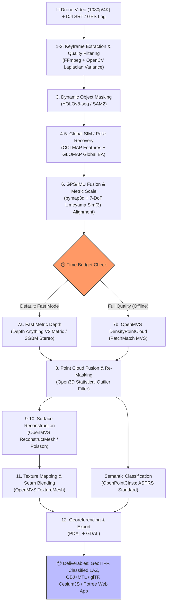

# Summerbreak

> **High-Speed, Georeferenced Offline Photogrammetry & Semantic 3D Classification from Monocular Drone Video**  
> *Targeting the Smart India Hackathon (SIH26158) Benchmark: Sub-15-Minute Turnaround on Single-GPU Workstations*

[](LICENSE)
[](https://www.python.org/downloads/)
[](https://developer.nvidia.com/cuda-toolkit)
[](https://colmap.github.io/)
[](https://github.com/colmap/glomap)
[](https://github.com/cdcseacave/openMVS)

---

## 📌 Executive Summary & Problem Framing

Standard real-time SLAM approaches (like **MASt3R-SLAM**) are designed for robot navigation, odometry, and semi-dense mapping; **they fail at generating measurement-grade textured meshes, calibrated metric scale, and GIS-compliant outputs**. 

Conversely, full classical photogrammetry pipelines (standard incremental COLMAP + OpenMVS PatchMatch) routinely exceed **30 to 45+ minutes** on standard 500-frame drone datasets (with `RefineMesh` alone taking ~20 minutes on an RTX 2060 Super).

This repository implements an **optimized, 12-stage hybrid photogrammetry DAG** engineered specifically for the SIH26158 15-minute turnaround constraint:
1. **Intelligent Keyframe Selection**: Downsamples 18,000 raw video frames (10 min 4K@30fps) into 400–600 sharp, high-parallax frames via Laplacian variance and telemetry filtering.
2. **Global Structure-from-Motion (GLOMAP)**: Replaces slow incremental Bundle Adjustment with global pose optimization.
3. **Closed-Form Metric Georeferencing**: 7-DoF Umeyama $\mathrm{Sim}(3)$ alignment mapping reconstructed camera centers directly to drone GPS/IMU (DJI SRT telemetry) in Local ENU coordinates.
4. **Adaptive Dual-Branch Depth Engine**:
   - **Fast Mode (Default, ~10–13 min total)**: Depth Anything V2 metric monocular / SGBM stereo pairs + Open3D fusion.
   - **Full-Quality Mode (~25–45 min offline)**: OpenMVS PatchMatch `DensifyPointCloud` + Delaunay `ReconstructMesh`.
5. **Triple-Stage Dynamic Masking**: YOLOv8-seg dynamic masks applied at **SfM feature extraction**, **point-cloud fusion**, and **mesh texture projection**.
6. **Point-Cloud Semantic Classification**: Automated ASPRS standard labeling (Ground, Building, High Veg, Road, Water) via **OpenPointClass** (~15M points in <2 minutes on CPU).
7. **GIS-Ready Deliverables & Interactive Viewer**: Georeferenced LAS/LAZ, GeoTIFF Orthomosaic, OBJ/MTL, and glTF/3D Tiles rendered on a CesiumJS/Potree geospatial web map.

---

## 🏗️ System Architecture at a Glance



*For complete architecture breakdown, data contracts, and mathematical derivations, see [ARCHITECTURE.md](file:///d:/sih/ARCHITECTURE.md).*

---

## ⏱️ Time Budget: Hitting the 15-Minute Target

Target workstation: Single GPU (NVIDIA RTX 3080 / 4070 or better, or cloud T4/A10G).  
Input: 10-minute 4K@30fps video (~18,000 frames) downsampled to **400–600 keyframes**.

| Pipeline Stage | Fast Mode (Live Demo Default) | Full-Quality Mode (Offline Benchmarking) |
| :--- | :---: | :---: |
| **1. Decode + Keyframe Scoring** | 1 – 2 min | 1 – 2 min |
| **2. Dynamic Masking (~500 frames)** | ~30 – 45 s | ~30 – 45 s |
| **3. Pose Recovery (GLOMAP + Seq Match)** | 2 – 4 min | 2 – 4 min |
| **4. Sim(3) GPS Umeyama Alignment** | < 1 s | < 1 s |
| **5. Dense Depth Generation** | **1 – 2 min** *(Depth Anything V2 / SGBM)* | **5 – 10+ min** *(OpenMVS DensifyPointCloud)* |
| **6. Mesh Reconstruction** | **1 – 2 min** *(ReconstructMesh only)* | **10 – 20 min** *(+ RefineMesh)* |
| **7. Texture Mapping** | ~1 min | 1 – 2 min |
| **8. Point Classification (OpenPointClass)**| < 1 – 2 min | < 1 – 2 min |
| **9. Georeference & Export (PDAL/GDAL)** | ~1 min | ~1 min |
| **🚀 Total Wall-Clock Time** | **~10 – 13 min (Passes <15m limit)** | **~25 – 45+ min (Exceeds limit)** |

> **Critical Design Principle**: In competitive evaluation, **default to Fast Mode**. Full-quality mode with `RefineMesh` is presented as an offline comparative case study. Never gamble a live 15-minute evaluation on `RefineMesh`.

---

## 🏆 Key Differentiators vs Competitors

| Evaluation Dimension | Peer Implementations (Aero3D, aerorecon, DroneMap) | **Our SIH26158 Architecture** |
| :--- | :--- | :--- |
| **Point Cloud Semantic Classification** | None or listed only as uncommitted "stretch goal" | **Shipped:** OpenPointClass ASPRS-standard classification (Ground, Building, Vegetation, Road, Water) in <2 min. |
| **Dynamic Object Masking** | Masked only during SfM feature extraction | **3-Tier Protection:** Reused in SfM, Open3D point fusion, and OpenMVS texture projection. |
| **Georeferencing & Scale** | Naive bounding-box placement or visual scaling | **Quantified:** Closed-form 7-DoF $\mathrm{Sim}(3)$ Umeyama alignment with automated **RMS-error metric reporting** against GPS ground track. |
| **Time-Budget Defense** | Fragile single pipeline that risks timeout | **Defensible Dual Mode:** Live timer check chooses Fast Mode (<13 min) with empirical benchmark justification. |
| **Occlusion Handling** | Fake hallucinated surfaces via aggressive smoothing | **Measurement-Grade Honesty:** Surfaces unobserved due to single-pass flight are left as verifiable gaps with per-surface coverage metrics. |
| **GIS Integration** | Raw OBJ files without CRS metadata | **Full GIS Suite:** Georeferenced LAS/LAZ, GeoTIFF Orthomosaics, and live CesiumJS 3D Tiles. |

---

## 🛠️ Repository & Tooling Stack

| Stage | Technology / Tool | Role in System |
| :--- | :--- | :--- |
| **Frame & Telemetry Ingest** | `FFmpeg`, `OpenCV`, `regex` | Frame extraction, blur scoring (Laplacian variance), DJI SRT telemetry parser |
| **Dynamic Masking** | `Ultralytics YOLOv8-seg` / `SAM2` | Ephemeral object segmentation (vehicles, pedestrians, dynamic clutter) |
| **Feature Extraction & Matching**| `COLMAP` (CUDA SIFT) | Sequential + Vocab-tree feature matching on ordered video keyframes |
| **Structure-from-Motion** | `GLOMAP` | Fast global bundle adjustment and camera pose trajectory recovery |
| **Georeferencing & Scale** | `pymap3d`, `pyproj`, `scipy` | Geodetic (WGS84) $\to$ Local ENU conversion + Umeyama $\mathrm{Sim}(3)$ closed-form solver |
| **Dense Depth** | `Depth Anything V2` / `OpenMVS` | Fast metric monocular depth / multi-view PatchMatch stereo |
| **Point Cloud Processing** | `Open3D`, `laspy` | Outlier removal, dynamic mask back-projection, point cloud fusion |
| **Surface Meshing & Texturing** | `OpenMVS` | Delaunay tetrahedral meshing, global seam leveling & texture projection |
| **Semantic Classification** | `OpenPointClass` | Geometric feature extraction & ASPRS point classification |
| **GIS Export & Orthomosaics** | `PDAL`, `GDAL`, `Shapely` | Coordinate transformations, GeoTIFF generation, building footprint metrics |
| **Web Service & Visualizer** | `FastAPI`, `CesiumJS`, `Potree` | Asynchronous job runner, upload API, geolocated 3D tiles viewer |

---

## 🚀 Quickstart & Setup Guide

### 1. Conda Environment Setup
```bash
# 1. Create and activate conda environment
conda create -n drone3d python=3.10 -y
conda activate drone3d

# 2. Install geospatial and core libraries via conda-forge
conda install -c conda-forge colmap pdal gdal pyproj -y

# 3. Install Python dependencies
pip install ultralytics open3d pymap3d numpy scipy laspy fastapi uvicorn shapely
```

### 2. Building Native Dependencies (GLOMAP & OpenMVS)
Both GLOMAP and OpenMVS require building from source against the installed COLMAP and CUDA toolkits:
```bash
# Build GLOMAP (Global SfM)
git clone https://github.com/colmap/glomap.git
cd glomap && mkdir build && cd build
cmake .. -GNinja -DCMAKE_BUILD_TYPE=Release
ninja && sudo ninja install

# Build OpenMVS (Dense MVS & Texturing)
git clone https://github.com/cdcseacave/openMVS.git
cd openMVS && mkdir build && cd build
cmake .. -DCMAKE_BUILD_TYPE=Release -DVCG_ROOT="/path/to/vcglib"
make -j$(nproc) && sudo make install
```

---

## 📂 Repository Structure

```text
├── ARCHITECTURE.md              # Exhaustive technical specification & mathematical models
├── PHASE_PLAN.md                # 4-person workstream breakdown, milestones & checklist
├── README.md                    # This document
├── configs/                     # YAML pipeline configurations (fast_mode, full_quality)
│   ├── pipeline_fast.yaml
│   └── pipeline_full.yaml
├── src/                         # Core Python pipeline
│   ├── 01_ingest/               # Keyframe extraction & DJI SRT telemetry parsing
│   ├── 02_masking/              # YOLOv8-seg dynamic object mask generator
│   ├── 03_sfm/                  # COLMAP feature extraction & GLOMAP mapper wrapper
│   ├── 04_georef/               # Umeyama Sim(3) GPS alignment & trajectory evaluation
│   ├── 05_depth/                # Depth Anything V2 / SGBM / OpenMVS depth engines
│   ├── 06_pointcloud/           # Open3D point fusion & OpenPointClass classification
│   ├── 07_mesh/                 # OpenMVS meshing & texture projection
│   ├── 08_export/               # PDAL/GDAL GeoTIFF & LAZ/glTF packaging
│   └── pipeline_runner.py       # Master DAG orchestrator with stage-timer logging
├── webapp/                      # FastAPI backend + CesiumJS / Potree front-end viewer
│   ├── api/
│   └── static/
└── tests/                       # Unit & integration tests for data contracts
```

---

## 📅 Roadmap & Execution Plan

For detailed assignments, inter-workstream data contracts, and week-by-week sprint goals, see **[PHASE_PLAN.md](file:///d:/sih/PHASE_PLAN.md)**:

- **Phase 0 (Now $\to$ 2026-09-30, Idea Round)**: Reproducible PoC render on sample clip, validated $\mathrm{Sim}(3)$ RMS error metric, submission dossier.
- **Phase 1 (Post-Selection Weeks 1–2)**: Core Pipeline (Keyframes $\to$ Masks $\to$ GLOMAP $\to$ Georef).
- **Phase 2 (Weeks 3–4)**: Geometry Engine (Dual-mode Depth $\to$ Open3D Fusion $\to$ OpenMVS Textured Mesh).
- **Phase 3 (Week 5)**: OpenPointClass ASPRS Semantic Classification + FastAPI / CesiumJS Web Application.
- **Phase 4 (Week 6, Grand Finale)**: Stress testing on diverse clips, footprint/height metric analytics, fault-injection tests & stage rehearsal.

---

## 📄 Licensing & Compliance Notes

- **Pipeline Core Modules**: COLMAP (`BSD`), GLOMAP (`BSD-3-Clause`), Open3D (`MIT`), PDAL/GDAL (`BSD/MIT-compatible`).
- **AGPL-3.0 Components**: Ultralytics YOLOv8, OpenMVS, and OpenPointClass are distributed under GNU AGPL v3.0.  
  *Note for deployment:* Acceptable for competition prototyping; if deployed as a commercial or defense-grade cloud network service, modifications to AGPL components must be open-sourced or swapped with permissive alternatives (e.g., PyTorch TorchVision Mask R-CNN, Poisson surface reconstruction via Open3D).

---
*Created for Smart India Hackathon — Problem Statement SIH26158.*
